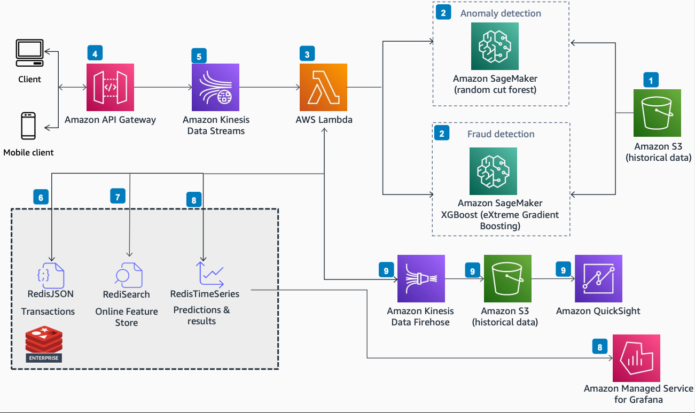

# Real-Time Fraud Detection Powered by Redis Enterprise Cloud

Publication date: **May 5, 2022 ([Diagram history](#fraud-redis-history "#fraud-redis-history"))**

With this architecture, you can detect fraud in real time by using Redis
Enterprise Cloud on AWS as both a primary database and an online feature store. The solution
uses [Amazon SageMaker AI](../../../sagemaker/latest/dg.md "../../../sagemaker/latest/dg.md") for machine
learning (ML) model inference, [Amazon Kinesis Data Streams](../../../streams/latest/dev.md "../../../streams/latest/dev.md") for event capture, and [AWS Lambda](../../../lambda/latest/dg.md "../../../lambda/latest/dg.md") for processing.

## Real-Time fraud detection diagram

The following steps describe the data flow and ML inference pipeline for this
architecture:

1. Store historical datasets of credit card transactions in an [Amazon Simple Storage Service](../../../AmazonS3/latest/userguide.md "../../../AmazonS3/latest/userguide.md") bucket.
2. Train different ML models by using an SageMaker AI notebook instance on the historical
   datasets.
3. Process transactions from the historical datasets by using a Lambda function. Invoke
   two SageMaker AI endpoints that assign anomaly scores and classification scores to incoming data
   points.
4. Invoke the [Amazon API Gateway](../../../apigateway/latest/developerguide.md "../../../apigateway/latest/developerguide.md") REST API for predictions by
   using signed HTTP requests from end users (mobile and web clients).
5. Capture real-time event data by using Amazon Kinesis Data Streams.
6. Read the stream by using a Lambda function. Persist transactional data to
   RediSearch and RedisJSON-enabled Redis
   Enterprise Cloud database.
7. Use Redis Enterprise Cloud as a feature store for the Lambda
   function. No Redis modules are required for this
   functionality.
8. Persist the prediction results to the Redis Enterprise Cloud database.
   (Optional) Store results with transactional details to a time-series database for data
   visualizations by using [Amazon Managed Service for Grafana](../../../grafana/latest/userguide.md "../../../grafana/latest/userguide.md").
9. (Optional) Pass prediction results through Amazon Data Firehose to persist data to an
   Amazon S3 bucket. Use [Amazon Quick Sight](../../../quicksight/latest/developerguide/welcome.md "../../../quicksight/latest/developerguide/welcome.md") to consume this data for
   visualizations and analytics.

## Further reading

For additional information, see the following resources:

- [AWS Architecture Icons](https://aws.amazon.com/architecture/icons "https://aws.amazon.com/architecture/icons")
- [AWS Architecture Center](https://aws.amazon.com/architecture/ "https://aws.amazon.com/architecture/")
- [AWS
  Well-Architected](https://aws.amazon.com/architecture/well-architected "https://aws.amazon.com/architecture/well-architected")

## Diagram history

To receive updates about this reference architecture diagram, subscribe to the RSS
feed.

| Change              | Description                                     | Date        |
| ------------------- | ----------------------------------------------- | ----------- |
| Initial publication | Reference architecture diagram first published. | May 5, 2022 |

###### RSS subscription requirement

To subscribe to RSS updates, you must have an RSS plugin enabled for the browser you are
using.
