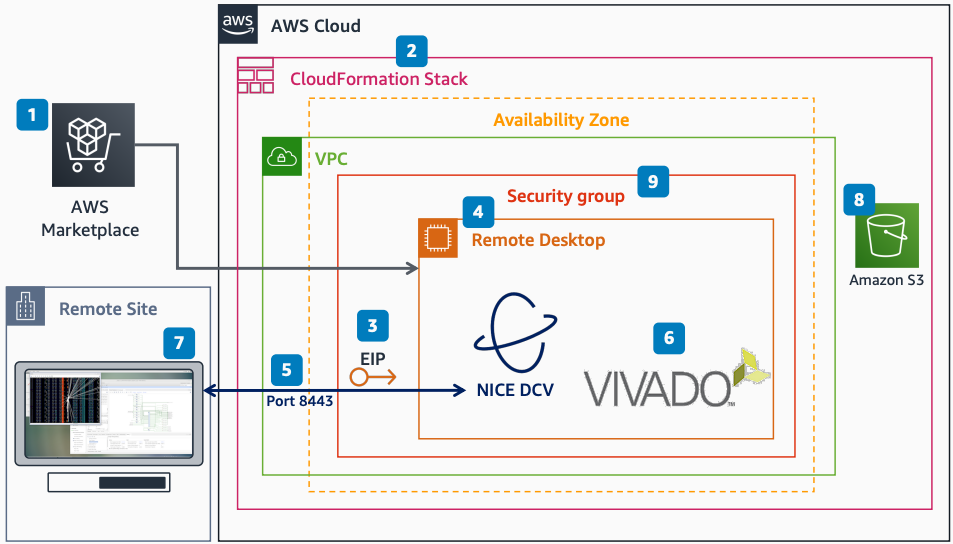

# Remote Desktop for Electronic Design Automation

Publication date: **April 5, 2021 ([Diagram history](#remote-eda-history "#remote-eda-history"))**

With this architecture, you can launch the Xilinx Vivado Design Suite by
using [Amazon DCV](../../../dcv/latest/adminguide.md "../../../dcv/latest/adminguide.md") remote desktop on
AWS. The solution uses the FPGA Developer Amazon Machine Image (AMI) from [AWS Marketplace](../../../marketplace/latest/buyerguide.md "../../../marketplace/latest/buyerguide.md"), which includes
Vivado pre-installed.

For more information about this workshop, see [aws-remote-desktop-for-eda](https://github.com/aws-samples/aws-remote-desktop-for-eda "https://github.com/aws-samples/aws-remote-desktop-for-eda")
on GitHub.

## Remote desktop for Electronic Design Automation diagram

The following steps describe the setup and connection flow for this architecture:

1. Subscribe to the FPGA Developer AMI in AWS Marketplace. The Xilinx Vivado
   Design Suite is included with this AMI.
2. Specify required parameters (Amazon VPC, subnet, Availability Zone) and launch the [AWS CloudFormation](../../../AWSCloudFormation/latest/UserGuide.md "../../../AWSCloudFormation/latest/UserGuide.md")
   stack.
3. (Optional) Create an Elastic IP address for a persistent IP.
4. Choose a remote desktop instance type that works for your tools.
5. Connect to Amazon DCV by using the Amazon DCV client or a web browser on port 8443.
6. In the FPGA Developer AMI, launch the Xilinx Vivado Design Suite by
   typing `vivado` in a terminal window.
7. The remote desktop displays on your local system.
8. (Optional) Configure [Amazon Simple Storage Service](../../../AmazonS3/latest/userguide.md "../../../AmazonS3/latest/userguide.md") bucket access to load design
   data.
9. (Optional) Specify additional existing security groups.

## Further reading

For additional information, see the following resources:

- [AWS Architecture Icons](https://aws.amazon.com/architecture/icons "https://aws.amazon.com/architecture/icons")
- [AWS Architecture Center](https://aws.amazon.com/architecture/ "https://aws.amazon.com/architecture/")
- [AWS
  Well-Architected](https://aws.amazon.com/architecture/well-architected "https://aws.amazon.com/architecture/well-architected")

## Diagram history

To receive updates about this reference architecture diagram, subscribe to the RSS
feed.

| Change              | Description                                     | Date          |
| ------------------- | ----------------------------------------------- | ------------- |
| Initial publication | Reference architecture diagram first published. | April 5, 2021 |

###### RSS subscription requirement

To subscribe to RSS updates, you must have an RSS plugin enabled for the browser you are
using.
