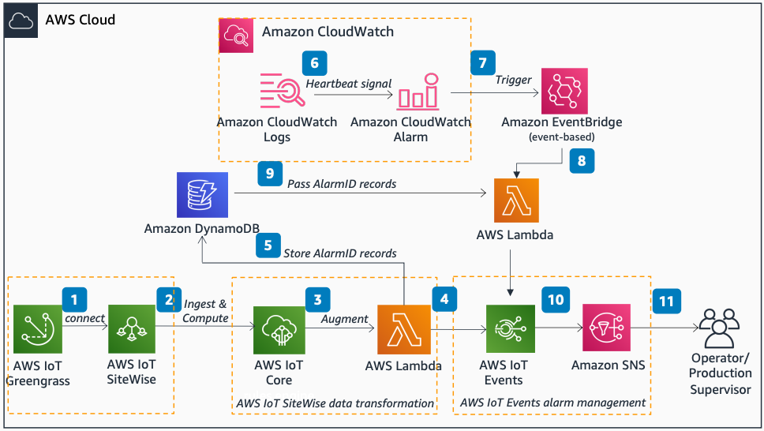

# Resilient AWS IoT Events Alarm for AWS IoT SiteWise

Publication date: **April 5, 2021 ([Diagram history](#riea-diagram-history "#riea-diagram-history"))**

With this architecture, you can efficiently monitor AWS IoT SiteWise metrics by using an
[AWS IoT Events](../../../whitepapers/latest/aws-overview/internet-of-things-services.md#aws-iot-events "../../../whitepapers/latest/aws-overview/internet-of-things-services.md#aws-iot-events")
alarm on an unstable network connection. This architecture uses [AWS IoT Greengrass](../../../greengrass/v2/developerguide.md "../../../greengrass/v2/developerguide.md"), [AWS IoT SiteWise](../../../iot-sitewise/latest/userguide.md "../../../iot-sitewise/latest/userguide.md"), [AWS IoT Core](../../../iot/latest/developerguide.md "../../../iot/latest/developerguide.md"), [AWS Lambda](../../../lambda/latest/dg.md "../../../lambda/latest/dg.md"), and [Amazon CloudWatch](../../../AmazonCloudWatch/latest/monitoring.md "../../../AmazonCloudWatch/latest/monitoring.md").

## Resilient IoT Events alarm architecture diagram

The following steps describe the architecture:

1. AWS IoT Greengrass configures a gateway to send industrial internet of things (IIoT) data to
   AWS IoT SiteWise.
2. AWS IoT SiteWise collects, stores, organizes, and monitors data from industrial equipment
   at scale. Operational technology (OT) can quickly compute industrial performance
   metrics for remote monitoring.
3. AWS IoT Core rules interact with MQTT topics of AWS IoT SiteWise metrics that
   OT wants to monitor. The rule augments data with an AlarmID so data goes to a
   specific alarm detector instance.
4. An Lambda function normalizes the JSON payload to extract the AlarmID and metric
   property values. It then sends them as inputs to AWS IoT Events.
5. (Optional) The Lambda function sends all AlarmID records to [Amazon DynamoDB](../../../amazondynamodb/latest/developerguide.md "../../../amazondynamodb/latest/developerguide.md") for future use.
6. CloudWatch Logs collects the AWS IoT SiteWise **Gateway.Heartbeat** metric to
   monitor health.
7. An CloudWatch alarm tracks CloudWatch Logs events where heartbeat signals are missing due to an
   internet or AWS service outage. The alarm then transitions to the ON state.
8. [Amazon EventBridge](../../../eventbridge/latest/userguide.md "../../../eventbridge/latest/userguide.md") triggers an Lambda function when
   the CloudWatch alarm turns ON.
9. EventBridge triggers an Lambda function to send the switch-off signal with AlarmID
   records to the AWS IoT Events alarm. You can obtain multiple AlarmIDs from DynamoDB.
10. The AWS IoT Events alarm detects a breach of metric property values. This alarm switches
    off automatically when the network is intermittent or disconnected.
11. AWS IoT Events sends an [Amazon Simple Notification Service](../../../sns/latest/dg.md "../../../sns/latest/dg.md") (Amazon SNS) notification if the alarm
    triggers.

## Further reading

For additional information, see the following resources:

- [AWS Architecture Icons](https://aws.amazon.com/architecture/icons "https://aws.amazon.com/architecture/icons")
- [AWS Architecture Center](https://aws.amazon.com/architecture "https://aws.amazon.com/architecture")
- [AWS Well-Architected](https://aws.amazon.com/architecture/well-architected "https://aws.amazon.com/architecture/well-architected")

## Diagram history

To be notified about updates to this reference architecture diagram, subscribe to the RSS feed.

| Change              | Description                                     | Date          |
| ------------------- | ----------------------------------------------- | ------------- |
| Initial publication | Reference architecture diagram first published. | April 5, 2021 |

###### RSS subscription

To subscribe to RSS updates, you must have an RSS plugin enabled for the browser that you are using.
