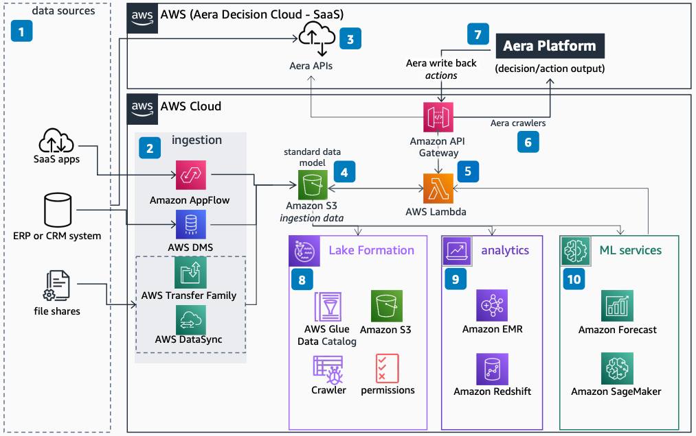

# Response Planning on AWS using Aera

Publication date: **November 4, 2022 ([Diagram history](#aera-history "#aera-history"))**

With this architecture, you can explore options for ingesting data and using AWS services
in an Aera Response Planning solution. You can connect SaaS apps, an enterprise
resource planning (ERP) or customer relationship management (CRM) system, and file shares to
the Aera platform.

## Architecture diagram

The following steps describe the architecture:

1. Various sources feed data into the Aera Response Planning solution,
   including SaaS apps, an ERP or CRM system, and file shares.
2. You can ingest data into the response planning SaaS solution by using native
   Aera APIs and SSH File Transfer Protocol (SFTP).
3. You can also ingest data into your AWS account. Service selection depends on the
   source. Use [AWS Database Migration Service](../../../dms/latest/userguide.md "../../../dms/latest/userguide.md") for SQL and NoSQL. Use [Amazon AppFlow](../../../appflow/latest/userguide.md "../../../appflow/latest/userguide.md") for a
   transportation management system (TMS), order management system (OMS), yard management system (YMS), or SaaS. Use [AWS DataSync](../../../datasync/latest/userguide.md "../../../datasync/latest/userguide.md") or [AWS Transfer Family](../../../transfer/latest/userguide.md "../../../transfer/latest/userguide.md") for a file
   share.
4. Store ingested data in [Amazon Simple Storage Service (Amazon S3)](../../../AmazonS3/latest/userguide.md "../../../AmazonS3/latest/userguide.md") in your AWS account.
5. You can batch-ingest AWS customer account data in Amazon S3 into the Aera
   SaaS solution by using the AWS SDK or [AWS Lambda](../../../lambda/latest/dg.md "../../../lambda/latest/dg.md") and [Amazon API Gateway](../../../apigateway/latest/developerguide.md "../../../apigateway/latest/developerguide.md").
6. Alternatively, Aera crawlers can batch-ingest Amazon S3 data into the
   Aera SaaS solution.
7. Collect outbound data from the Aera SaaS solution in Amazon S3 by using
   Aera Write Back (Actions), standard Amazon S3 APIs, or AWS Lambda and
   Amazon API Gateway.
8. Integrate Aera SaaS data into an AWS data lake built with Amazon S3,
   [AWS Glue](../../../glue/latest/dg.md "../../../glue/latest/dg.md"), IAM for
   permissions, and [AWS Lake Formation](../../../lake-formation/latest/dg.md "../../../lake-formation/latest/dg.md").
9. Integrate outbound data in Amazon S3 for analytics by using [Amazon EMR](../../../emr/latest/ManagementGuide.md "../../../emr/latest/ManagementGuide.md") and [Amazon Redshift](../../../redshift/latest/dg.md "../../../redshift/latest/dg.md").
10. Integrate outbound data in Amazon S3 for machine learning by using [Amazon SageMaker AI](../../../sagemaker/latest/dg.md "../../../sagemaker/latest/dg.md") and [Amazon Forecast](../../../forecast/latest/dg.md "../../../forecast/latest/dg.md").

## Further reading

For additional information, see the following resources:

- [AWS Architecture Icons](https://aws.amazon.com/architecture/icons "https://aws.amazon.com/architecture/icons")
- [AWS Architecture Center](https://aws.amazon.com/architecture/ "https://aws.amazon.com/architecture/")
- [AWS Well-Architected](https://aws.amazon.com/architecture/well-architected "https://aws.amazon.com/architecture/well-architected")

## Diagram history

To receive updates about this reference architecture diagram, subscribe to the RSS
feed.

| Change              | Description                                     | Date             |
| ------------------- | ----------------------------------------------- | ---------------- |
| Initial publication | Reference architecture diagram first published. | November 4, 2022 |

###### RSS subscription requirement

To subscribe to RSS updates, you must have an RSS plugin enabled for the browser you
are using.
