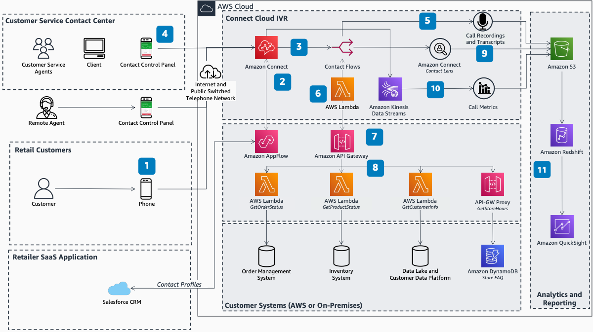

# Retail Customer Service Contact Center

Publication date: **December 9, 2021 ([Diagram history](#rcc-history "#rcc-history"))**

With this architecture, you can transform your retail customer service channel by using
natural language processing (NLP) and automation. Physical and ecommerce retailers use
[Amazon Connect Customer](../../../connect/latest/adminguide.md "../../../connect/latest/adminguide.md") to simplify
customer interactions across voice, text, and chat channels.

## Retail contact center diagram

The following steps describe the architecture:

1. Customers contact the retailer's service number. Connect Customer automatically answers
   and greets the customer with a natural interactive voice response (IVR).
2. Connect Customer integrates with a customer relationship management (CRM) system such as
   Salesforce. Amazon AppFlow retrieves customer data such as name, membership
   status, and loyalty points.
3. Connect Customer manages enquiries through skills-based routing and contact flows. Calls are
   routed to the appropriate automation or transferred to agents when needed.
4. Agents answer calls through the Connect Customer Contact Control Panel (CCP) and soft phone.
   Because calls are placed over the internet, agents work from any location.
5. Managers monitor live conversations and review recordings. Connect Customer stores call
   recordings in Amazon S3 at the conclusion of each call.
6. Contact Lens, a feature of Connect Customer, provides real-time insights such as call
   sentiment analysis, transcripts, and detailed analytics.
7. Connect Customer stores call metadata such as call lengths, wait times, and agent activity.
   Connect Customer streams this data through Amazon Kinesis for near real-time processing.
8. Data stored in Amazon S3 is ingested into [Amazon Redshift](../../../redshift/latest/dg.md "../../../redshift/latest/dg.md") and visualized on a dashboard by using
   [Amazon Quick Sight](../../../quicksight/latest/developerguide/welcome.md "../../../quicksight/latest/developerguide/welcome.md").
9. Connect Customer integrates with external systems. Retailers connect to their data lake,
   customer data platform, or order management systems to answer common enquiries.
10. [API Gateway](../../../apigateway/latest/developerguide.md "../../../apigateway/latest/developerguide.md")
    exposes backend services and microservices as scalable, secure APIs for reuse
    throughout the organization.
11. [Lambda](../../../lambda/latest/dg.md "../../../lambda/latest/dg.md") functions run
    business logic such as database lookups. [DynamoDB](../../../amazondynamodb/latest/developerguide.md "../../../amazondynamodb/latest/developerguide.md") provides low-latency
    lookups directly from API Gateway.

## Further reading

For additional information, see the following resources:

- [AWS Architecture Icons](https://aws.amazon.com/architecture/icons "https://aws.amazon.com/architecture/icons")
- [AWS Architecture Center](https://aws.amazon.com/architecture/ "https://aws.amazon.com/architecture/")
- [AWS Well-Architected](https://aws.amazon.com/architecture/well-architected "https://aws.amazon.com/architecture/well-architected")

## Diagram history

To receive updates about this reference architecture diagram, subscribe to the RSS
feed.

| Change              | Description                                     | Date             |
| ------------------- | ----------------------------------------------- | ---------------- |
| Initial publication | Reference architecture diagram first published. | December 9, 2021 |

###### RSS subscription requirement

To subscribe to RSS updates, you must have an RSS plugin enabled for the browser you
are using.
