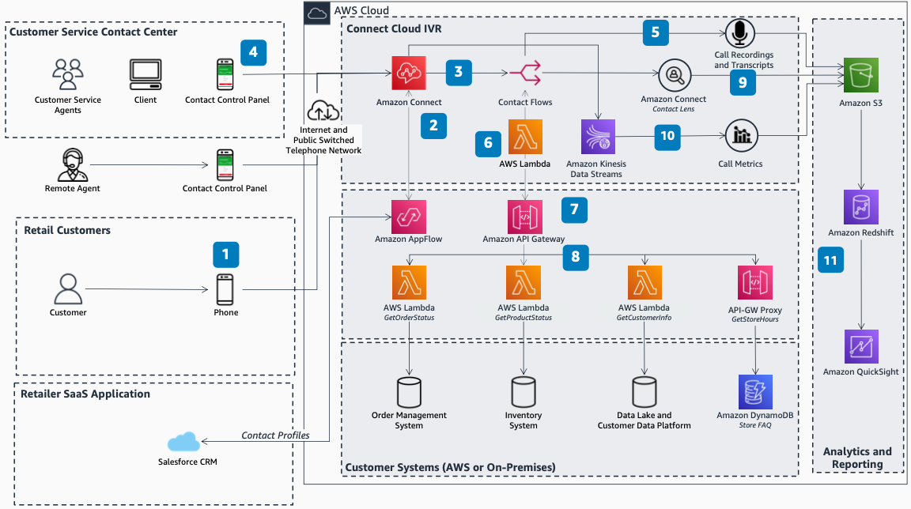

# Retail Customer Service Contact Center Using Amazon Connect

Publication date: **December 9, 2021 ([Diagram history](#diagram-history "#diagram-history"))**

This reference architecture diagram shows how retailers can simplify and transform their customer service channel with NLP and automation by using [Amazon Connect](../../../connect/latest/adminguide/what-is-amazon-connect.md "../../../connect/latest/adminguide/what-is-amazon-connect.md").

## Retail Customer Service Contact Center Using Amazon Connect

1. Customers contact a retailer's customer service number. Amazon Connect automatically answers with a natural interactive voice response (IVR) and retrieves customer information for personalized greetings.
2. Agents answer calls routed to them through the Amazon Connect Contact Control Panel (CCP) and soft phone. Agents can answer calls from anywhere, including remote environments.
3. Amazon Connect integrates with a CRM system (such as Salesforce), powered by Amazon AppFlow. This retrieves customer data such as name, membership status, and loyalty points.
4. Amazon Connect manages customer enquiries through skills-based routing and contact flows. Calls route automatically through conversational NLP interactions, database lookups, and transfers to agents when appropriate.
5. Contact Lens, a feature of Amazon Connect, provides agents with real-time insights such as call sentiment analysis, transcripts, and detailed analytics.
6. Amazon Connect stores call metadata (call lengths, wait times, call abandonment, agent activity). Data streams through [Amazon Kinesis Data Streams](../../../streams/latest/dev/introduction.md "../../../streams/latest/dev/introduction.md") for near real-time processing.
7. Data stored in [Amazon Simple Storage Service](../../../AmazonS3/latest/userguide/Welcome.md "../../../AmazonS3/latest/userguide/Welcome.md") links to a contact trace record. Ingest into [Amazon Redshift](../../../redshift/latest/dg/welcome.md "../../../redshift/latest/dg/welcome.md") and visualize on [Amazon QuickSight](../../../quicksight/latest/user/welcome.md "../../../quicksight/latest/user/welcome.md") dashboards.
8. Amazon Connect integrates with external systems. Retailers integrate with data lakes, customer data platforms, or order management systems for common enquiries.
9. [Amazon API Gateway](../../../apigateway/latest/developerguide/welcome.md "../../../apigateway/latest/developerguide/welcome.md") exposes your organization's capabilities as scalable, secure, and standardized API services.
10. [AWS Lambda](../../../lambda/latest/dg/welcome.md "../../../lambda/latest/dg/welcome.md") functions provide a scalable and serverless method of running business logic. [Amazon DynamoDB](../../../amazondynamodb/latest/developerguide/Introduction.md "../../../amazondynamodb/latest/developerguide/Introduction.md") provides a lightweight NoSQL datastore for low-latency lookups.
11. Managers monitor live conversations and review recordings. Amazon Connect stores recordings in Amazon Simple Storage Service at the conclusion of each call.

## Further reading

For additional information, refer to

- [AWS Architecture Icons](https://aws.amazon.com/architecture/icons "https://aws.amazon.com/architecture/icons")
- [AWS Architecture Center](https://aws.amazon.com/architecture "https://aws.amazon.com/architecture")
- [AWS Well-Architected](https://aws.amazon.com/architecture/well-architected "https://aws.amazon.com/architecture/well-architected")
- [Amazon Connect product page](https://aws.amazon.com/connect/ "https://aws.amazon.com/connect/")

## Diagram history

To be notified about updates to this reference architecture diagram, subscribe to the RSS feed.

| Change              | Description                                     | Date             |
| ------------------- | ----------------------------------------------- | ---------------- |
| Initial publication | Reference architecture diagram first published. | December 9, 2021 |

###### Note

To subscribe to RSS updates, you must have an RSS plugin enabled for the browser you are using.
