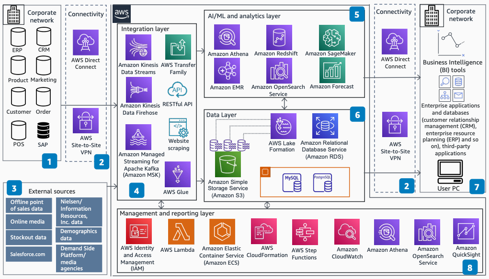

# Revenue Growth Management System on AWS

Publication date: **March 25, 2022 ([Diagram history](#rgm-history "#rgm-history"))**

With this architecture, you can build a revenue growth management (RGM) system on AWS.
A strong RGM system increases revenue by delivering the right brand, pack, or brand-and-pack
mix, to the right consumer, at the right price, on the right occasion. You can unlock revenue
growth at the intersection of demand shaping, multi-touch attribution, and marketing mix.

## Architecture diagram

The following steps describe the architecture:

1. Your on-premises systems store data in various internal formats.
2. Use [AWS Direct Connect](../../../directconnect/latest/UserGuide.md "../../../directconnect/latest/UserGuide.md") or AWS Site-to-Site VPN for connectivity.
   (Optional) Skip this step if your sources are already on AWS.
3. External data sources include publicly available data such as demographics, paid
   data such as Nielsen or IRI, online media, marketing
   agency data, and trading partners' point-of-sale (POS) data.
4. Internal and external sources share an integration layer built on [Amazon MSK](../../../msk/latest/developerguide.md "../../../msk/latest/developerguide.md"), [Amazon Kinesis Data Streams](../../../kinesis/latest/dev.md "../../../kinesis/latest/dev.md"), and Amazon Kinesis
   Data Firehose for streaming and ingestion. Use [AWS Transfer Family](../../../transfer/latest/userguide.md "../../../transfer/latest/userguide.md") for file transfer and [AWS Glue](../../../glue/latest/dg.md "../../../glue/latest/dg.md") for extract, transform, and
   load (ETL). You can use REST clients for API calls or scrape websites for data.
5. As a data analyst or engineer, you get different access to the data lakes. You can
   visualize and analyze data with [Amazon EMR](../../../emr/latest/ManagementGuide.md "../../../emr/latest/ManagementGuide.md"), [Amazon Athena](../../../athena/latest/ug.md "../../../athena/latest/ug.md"), [Amazon Redshift](../../../redshift/latest/dg.md "../../../redshift/latest/dg.md"), and Amazon OpenSearch Service. You can also
   train ML algorithms for demand shaping, sensing, and forecasting by using [Amazon SageMaker AI](../../../sagemaker/latest/dg.md "../../../sagemaker/latest/dg.md") and [Amazon Forecast](../../../forecast/latest/dg.md "../../../forecast/latest/dg.md").
6. Raw and curated data from the data lakes on [Amazon Simple Storage Service (Amazon S3)](../../../AmazonS3/latest/userguide.md "../../../AmazonS3/latest/userguide.md") with [AWS Lake Formation](../../../lake-formation/latest/dg.md "../../../lake-formation/latest/dg.md") provides the
   object storage layer with access control per user group. Amazon RDS stores relational data.
   Existing relational databases can run on [Amazon EC2](../../../AWSEC2/latest/UserGuide.md "../../../AWSEC2/latest/UserGuide.md") for a lift-and-shift option.
7. Services and data on AWS are accessible from existing internal and third-party
   applications on corporate networks through the connectivity layer.
8. The management and reporting layer provides ad hoc reporting, monitoring, security,
   data protection, and other native AWS service integration. This layer uses IAM,
   CloudFormation, Amazon CloudWatch, and Amazon ECS.

## Further reading

For additional information, see the following resources:

- [AWS Architecture Icons](https://aws.amazon.com/architecture/icons "https://aws.amazon.com/architecture/icons")
- [AWS Architecture Center](https://aws.amazon.com/architecture/ "https://aws.amazon.com/architecture/")
- [AWS Well-Architected](https://aws.amazon.com/architecture/well-architected "https://aws.amazon.com/architecture/well-architected")

## Diagram history

To receive updates about this reference architecture diagram, subscribe to the RSS
feed.

| Change              | Description                                     | Date           |
| ------------------- | ----------------------------------------------- | -------------- |
| Initial publication | Reference architecture diagram first published. | March 25, 2022 |

###### RSS subscription requirement

To subscribe to RSS updates, you must have an RSS plugin enabled for the browser you
are using.
