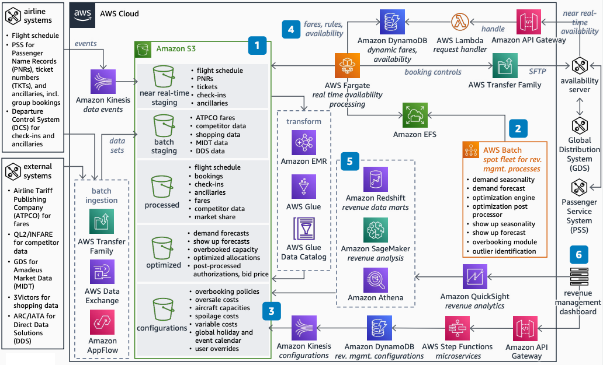

# Revenue Management Architecture for Airlines

Publication date: **April 5, 2023 ([Diagram history](#revenue-management-airlines-history "#revenue-management-airlines-history"))**

This reference architecture provides a migration path for airline revenue management
systems to AWS. Airlines use this architecture to scale revenue management workloads,
add near real-time data feeds, and reduce infrastructure costs. Revenue management teams
can dynamically adjust booking controls and meet changing analytics needs.

On-premises revenue management systems cannot scale to meet growing business demands
without significant cost increases. They cannot add near real-time data feeds from sources
such as ATPCO, QL2/INFARE, and 3Victors.
Dynamic adjustments to booking controls and reporting needs require a cloud-native
approach.

This migration architecture builds on the [Airlines Data Platform](../airlines-data-platform/airlines-data-platform.md "../airlines-data-platform/airlines-data-platform.md")
foundation.

## Revenue management architecture diagram

The following steps describe the architecture:

1. Use a tiered data lake on [Amazon S3](../../../AmazonS3/latest/userguide.md "../../../AmazonS3/latest/userguide.md") for ingestion and processing of
   batch and near real-time data feeds. Add new data feeds and propagate data changes
   without reengineering the platform.
2. Migrate existing revenue management modules to [Amazon EC2](../../../AWSEC2/latest/UserGuide.md "../../../AWSEC2/latest/UserGuide.md") Spot Instances. Reduce infrastructure
   costs compared to on-premises systems. Use [Amazon EFS](../../../efs/latest/ug.md "../../../efs/latest/ug.md") to replicate the file structure that the
   modules require.
3. Convert outputs from revenue management modules and store them in the data lake.
   Make outputs available for reporting and analytics.
4. Use Amazon EC2 On-Demand Instances for near real-time booking controls. Update fares,
   rules, and availability in [DynamoDB](../../../amazondynamodb/latest/developerguide.md "../../../amazondynamodb/latest/developerguide.md") for availability
   services.
5. Provide flexible reporting by using the data lake with [Amazon Redshift](../../../redshift/latest/dg.md "../../../redshift/latest/dg.md") and [Athena](../../../athena/latest/ug.md "../../../athena/latest/ug.md").
6. Build a revenue management dashboard for reporting, analytics, and configuration
   adjustments.

## Further reading

For additional information, see the following resources:

- [AWS Architecture Icons](https://aws.amazon.com/architecture/icons "https://aws.amazon.com/architecture/icons")
- [AWS Architecture Center](https://aws.amazon.com/architecture/ "https://aws.amazon.com/architecture/")
- [AWS Well-Architected](https://aws.amazon.com/architecture/well-architected "https://aws.amazon.com/architecture/well-architected")

## Diagram history

To receive updates about this reference architecture diagram, subscribe to the RSS
feed.

| Change              | Description                                     | Date          |
| ------------------- | ----------------------------------------------- | ------------- |
| Initial publication | Reference architecture diagram first published. | April 5, 2023 |

###### RSS subscription requirement

To subscribe to RSS updates, you must have an RSS plugin enabled for the browser you
are using.
