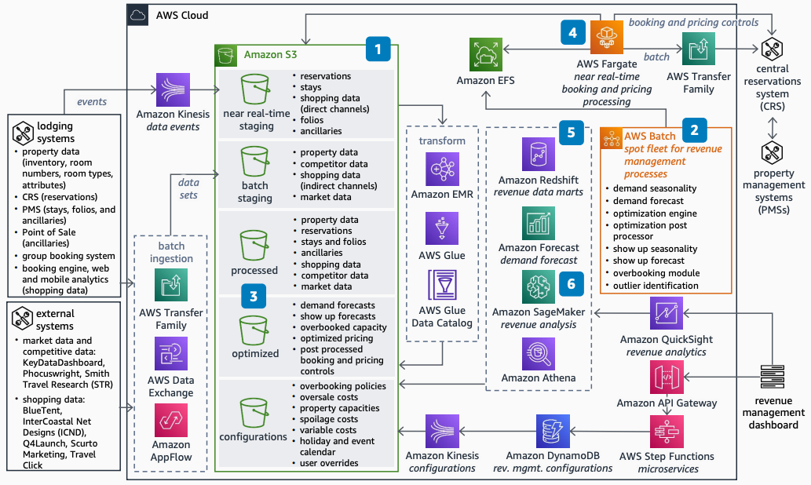

# Revenue Management Architecture for Lodging

Publication date: **October 5, 2022 ([Diagram history](#revmgmt-history "#revmgmt-history"))**

With this architecture, you can migrate an on-premises revenue management system to AWS.
On-premises systems often limit your ability to add real-time data feeds and respond to booking
changes quickly. Reduce infrastructure costs and improve forecasting accuracy by using [Amazon Forecast](../../../forecast/latest/dg.md "../../../forecast/latest/dg.md") for demand forecasting,
[Amazon SageMaker AI](../../../sagemaker/latest/dg.md "../../../sagemaker/latest/dg.md") for advanced analytics,
and [Amazon Elastic Compute Cloud](../../../AWSEC2/latest/UserGuide.md "../../../AWSEC2/latest/UserGuide.md") Spot Instances
for cost-efficient compute.

## Revenue management diagram

The following steps describe the architecture:

1. Build a tiered data lake by using [Amazon Simple Storage Service](../../../AmazonS3/latest/userguide.md "../../../AmazonS3/latest/userguide.md"). Ingest and process data from batch
   and near real-time feeds. Add new data feeds and propagate data changes.
2. Migrate existing revenue management modules to use Amazon EC2 Spot Instances. Reduce
   infrastructure cost without code changes. Use [Amazon Elastic File System (Amazon EFS)](../../../efs/latest/ug.md "../../../efs/latest/ug.md") to replicate the
   file structure required by the modules.
3. Convert outputs from the revenue management modules and store them in the data lake.
   Use these stored outputs for reporting and analytics.
4. Run near real-time booking controls on Amazon EC2 On-Demand Instances. Adjust booking and
   pricing controls dynamically.
5. Provide flexible, on-demand reporting by using the data lake with [Amazon Redshift](../../../redshift/latest/mgmt.md "../../../redshift/latest/mgmt.md") and [Amazon Athena](../../../athena/latest/ug.md "../../../athena/latest/ug.md"). Access raw, processed,
   and optimized data.
6. Use Forecast for regional demand forecasting models. Use SageMaker AI for advanced revenue
   analytics.
7. Build a revenue management dashboard for reporting, analytics, and adjustments to
   configurations and user overrides.

## Further reading

For additional information, see the following resources:

- [AWS Architecture Icons](https://aws.amazon.com/architecture/icons "https://aws.amazon.com/architecture/icons")
- [AWS Architecture Center](https://aws.amazon.com/architecture/ "https://aws.amazon.com/architecture/")
- [AWS Well-Architected](https://aws.amazon.com/architecture/well-architected "https://aws.amazon.com/architecture/well-architected")

## Diagram history

To receive updates about this reference architecture diagram, subscribe to the RSS
feed.

| Change              | Description                                     | Date            |
| ------------------- | ----------------------------------------------- | --------------- |
| Initial publication | Reference architecture diagram first published. | October 5, 2022 |

###### RSS subscription requirement

To subscribe to RSS updates, you must have an RSS plugin enabled for the browser you
are using.
