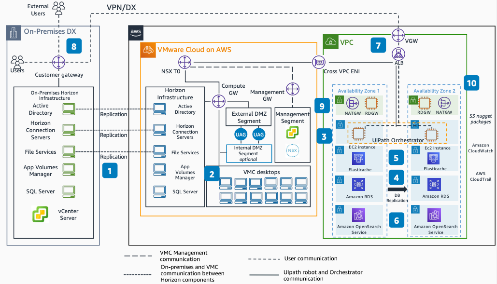

# Robotic Processing: Automation and VDI on AWS

Publication date: **December 7, 2021 ([Diagram history](#rpa-diagram-history "#rpa-diagram-history"))**

With this architecture, you can integrate UiPath for running robotics
process automation (RPA) with VMware Cloud on AWS. You use [Amazon Elastic Compute Cloud](../../../AWSEC2/latest/UserGuide.md "../../../AWSEC2/latest/UserGuide.md"), [Amazon Relational Database Service](../../../AmazonRDS/latest/UserGuide.md "../../../AmazonRDS/latest/UserGuide.md") (Amazon RDS), [Amazon ElastiCache](../../../AmazonElastiCache/latest/dg/WhatIs.md "../../../AmazonElastiCache/latest/dg/WhatIs.md"), and [Amazon OpenSearch Service](../../../opensearch-service/latest/developerguide.md "../../../opensearch-service/latest/developerguide.md") to
support the automation infrastructure.

## Robotic processing automation and VDI architecture diagram

The following steps describe the architecture:

1. Deploy the Horizon View platform on VMware Cloud on
   AWS. Connect it with on-premises VMware Horizon in hybrid mode over
   VPN and [AWS Direct Connect](../../../directconnect/latest/UserGuide.md "../../../directconnect/latest/UserGuide.md").
2. The UiPath database stores process and results queues on Amazon RDS with
   a read replica in a different Availability Zone.
3. Install UiPath Orchestrator on Amazon EC2 instances. Use load balancing
   across multiple Availability Zones.
4. Install UiPath robots in VMware Cloud on AWS
   Horizon virtual desktop infrastructure (VDI).
5. Use Amazon ElastiCache to cache session state and frequent queries for UiPath
   Orchestrator.
6. Send UiPath Orchestrator logs to Amazon OpenSearch Service for searching and
   analyzing data.
7. UiPath Orchestrator and robots connect through a cross-VPC elastic
   network interface (ENI).
8. Users log in to UiPath Orchestrator through VPN or Direct Connect.
   Requests pass through an Application Load Balancer.
9. (Optional) Use an RD gateway and NAT gateway for secure internet access to
   UiPath Orchestrator.
10. (Optional) Store UiPath nugget packages in [Amazon S3](../../../AmazonS3/latest/userguide.md "../../../AmazonS3/latest/userguide.md"). Use [AWS CloudTrail](../../../awscloudtrail/latest/userguide.md "../../../awscloudtrail/latest/userguide.md") and [Amazon CloudWatch](../../../AmazonCloudWatch/latest/monitoring.md "../../../AmazonCloudWatch/latest/monitoring.md") for
    auditing and monitoring.

## Further reading

For additional information, see the following resources:

- [AWS Architecture Icons](https://aws.amazon.com/architecture/icons "https://aws.amazon.com/architecture/icons")
- [AWS Architecture Center](https://aws.amazon.com/architecture "https://aws.amazon.com/architecture")
- [AWS Well-Architected](https://aws.amazon.com/architecture/well-architected "https://aws.amazon.com/architecture/well-architected")

## Diagram history

To be notified about updates to this reference architecture diagram, subscribe to the RSS feed.

| Change              | Description                                     | Date             |
| ------------------- | ----------------------------------------------- | ---------------- |
| Initial publication | Reference architecture diagram first published. | December 7, 2021 |

###### RSS subscription

To subscribe to RSS updates, you must have an RSS plugin enabled for the browser that you are using.
