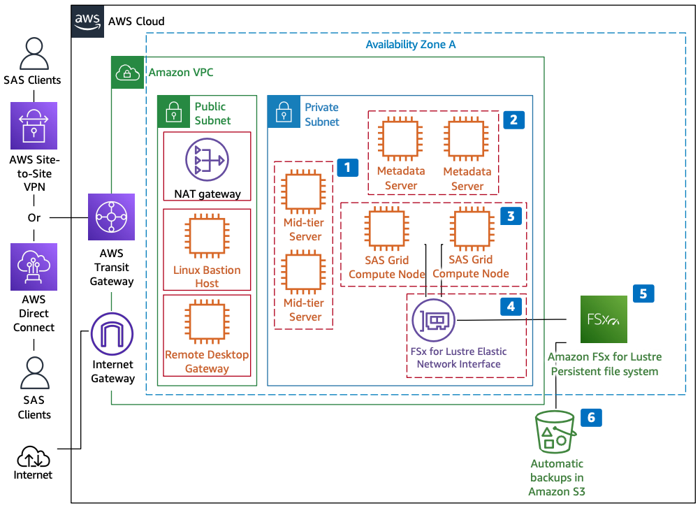

# Running SAS Grid on AWS

Publication date: **July 25, 2022 ([Diagram history](#sas-diagram-history "#sas-diagram-history"))**

With this architecture, you can deploy high-performing [FSx for Lustre](../../../fsx/latest/LustreGuide/what-is.md "../../../fsx/latest/LustreGuide/what-is.md") file system storage for SAS Grid. You also get guidance on the [Amazon EC2](../../../AWSEC2/latest/UserGuide/concepts.md "../../../AWSEC2/latest/UserGuide/concepts.md") instance types best suited for the SAS Grid compute tier.

## Running SAS Grid on AWS

The following steps describe the architecture:

1. For mid-tier servers, select Amazon EC2 r5 instance types. Use these to run Platform Web Services (PWS) and the Load Sharing Facility (LSF) client. Two or more instances is not a SAS requirement unless you require high availability (HA).
2. For metadata servers, select Amazon EC2 r5 instance types that meet or exceed the minimum recommendations from SAS. For memory, use the larger of 8 GB per physical core or 24 GB. Three or more instances is not a SAS requirement unless you require HA.
3. For SAS Grid compute nodes running the LSF platform, select Amazon EC2 instance types that meet or exceed the minimum recommendations from SAS. For memory, use 8 GB per physical core. For file system performance, use 100-125 MB/s per physical core.

We recommend the Amazon EC2 m5n and r5n instance types when hosting /SASDATA, /SASWORK, and /UTILLOC on FSx for Lustre. Use i3en instance types when offloading /SASWORK to local instance store volumes. 4. The FSx for Lustre file system is accessible through an elastic network interface in your virtual private cloud (VPC). Use standard [Amazon VPC](../../../vpc/latest/userguide/what-is-amazon-vpc.md "../../../vpc/latest/userguide/what-is-amazon-vpc.md") security groups to control network access to your file system. 5. Use FSx for Lustre persistent file systems for all SAS Grid libraries. These libraries include /SASDATA, /SASWORK, and /UTILLOC.

FSx for Lustre is a fully managed Lustre file system. It delivers hundreds of gigabytes per second of throughput and millions of IOPS. It provides submillisecond latencies and supports encryption of data at rest and in transit. 6. FSx for Lustre stand-alone file systems provide automatic, highly durable, file-system-consistent, incremental backups. FSx for Lustre stores these backups in [Amazon S3](../../../AmazonS3/latest/userguide/Welcome.md "../../../AmazonS3/latest/userguide/Welcome.md").

## Further reading

For additional information, see the following resources:

- [AWS Architecture Icons](https://aws.amazon.com/architecture/icons "https://aws.amazon.com/architecture/icons")
- [AWS Architecture Center](https://aws.amazon.com/architecture "https://aws.amazon.com/architecture")
- [AWS Well-Architected](https://aws.amazon.com/architecture/well-architected "https://aws.amazon.com/architecture/well-architected")

## Diagram history

To be notified about updates to this reference architecture diagram, subscribe to the RSS feed.

| Change              | Description                                     | Date          |
| ------------------- | ----------------------------------------------- | ------------- |
| Initial publication | Reference architecture diagram first published. | July 25, 2022 |

###### RSS subscription

To subscribe to RSS updates, you must have an RSS plugin enabled for the browser that you are using.
