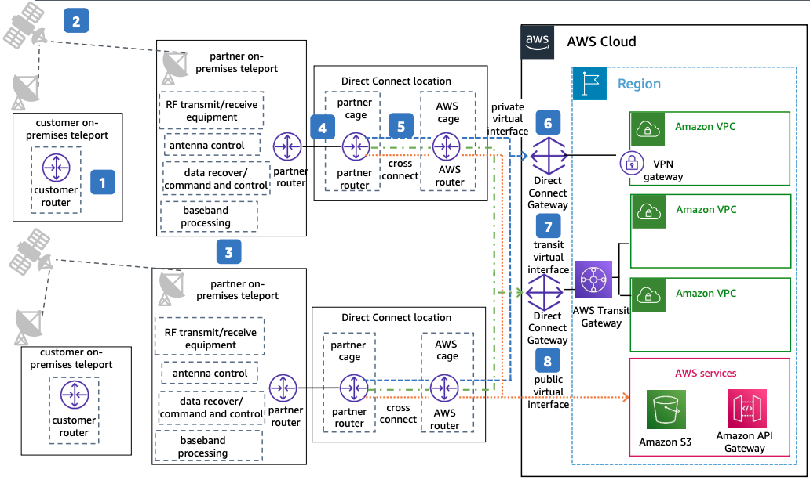

# Satellite Operator High Resiliency

Publication date: **April 25, 2023 ([Diagram history](#sat-high-history "#sat-high-history"))**

With this architecture, you can achieve high resiliency for satellite operator workloads.
The solution uses one connection terminating at multiple locations through an AWS Direct Connect
Service Delivery Partner with redundant satellite infrastructure.

## Satellite operator high resiliency diagram

The following steps describe the data flow and connectivity setup for this architecture:

1. Use satellite communications from your on-premises locations to communicate back to
   your AWS Cloud environment. Use one customer router and one satellite antenna in
   multiple locations.
2. Work with an [AWS Direct
   Connect Service Delivery Partner](https://aws.amazon.com/directconnect/partners/ "https://aws.amazon.com/directconnect/partners/") that provides redundant satellite
   infrastructure.
3. The partner provides teleport connectivity with one physical connection on two
   different devices at multiple locations and handles necessary demodulation of your
   data.
4. The partner sets up one physical connection on different devices at multiple sites.
   Use these connections for dedicated or hosted connectivity.
5. Order dedicated connectivity or hosted connectivity from the AWS Direct Connect
   Service Delivery Partner.
6. (Optional) Enable MAC Security.
7. (Optional) Provision private virtual interfaces (VIFs) to access your private AWS
   resources through [Direct Connect
   Gateway](../../../directconnect/latest/UserGuide/direct-connect-gateways-intro.md "../../../directconnect/latest/UserGuide/direct-connect-gateways-intro.md").
8. (Optional) Provision transit VIFs to access your private AWS resources through
   Direct Connect Gateway and [AWS
   Transit Gateway](../../../whitepapers/latest/building-scalable-secure-multi-vpc-network-infrastructure/transit-gateway.md "../../../whitepapers/latest/building-scalable-secure-multi-vpc-network-infrastructure/transit-gateway.md").
9. (Optional) Provision public VIFs to access your public AWS resources such as
   [Amazon Simple Storage Service](../../../AmazonS3/latest/userguide/Welcome.md "../../../AmazonS3/latest/userguide/Welcome.md")
   and [Amazon API Gateway](../../../apigateway/latest/developerguide/welcome.md "../../../apigateway/latest/developerguide/welcome.md"). Connectivity can
   be Regional or global.

## Further reading

For additional information, see the following resources:

- [AWS Architecture Icons](https://aws.amazon.com/architecture/icons "https://aws.amazon.com/architecture/icons")
- [AWS Architecture Center](https://aws.amazon.com/architecture/ "https://aws.amazon.com/architecture/")
- [AWS
  Well-Architected](https://aws.amazon.com/architecture/well-architected "https://aws.amazon.com/architecture/well-architected")

## Diagram history

To receive updates about this reference architecture diagram, subscribe to the RSS
feed.

| Change                                                                                                                                     | Description                                     | Date           |
| ------------------------------------------------------------------------------------------------------------------------------------------ | ----------------------------------------------- | -------------- |
| [Initial publication](satellite-operator-dev-test.md#sat-dev-history "satellite-operator-dev-test.md#sat-dev-history")                     | Reference architecture diagram first published. | April 25, 2023 |
| Initial publication                                                                                                                        | Reference architecture diagram first published. | April 25, 2023 |
| [Initial publication](satellite-operator-maximum-resiliency.md#sat-max-history "satellite-operator-maximum-resiliency.md#sat-max-history") | Reference architecture diagram first published. | April 25, 2023 |

###### RSS subscription requirement

To subscribe to RSS updates, you must have an RSS plugin enabled for the browser you are
using.
