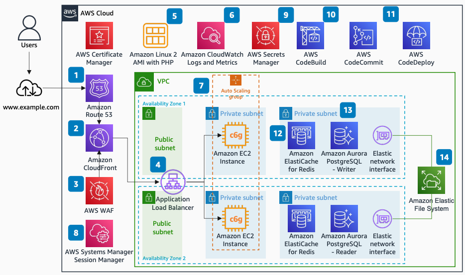

# Scaling PHP Applications on AWS

Publication date: **January 20, 2022 ([Diagram history](#diagram-history "#diagram-history"))**

This architecture shows how to run highly available, performant, and secure PHP applications on AWS. You use [Amazon Elastic Compute Cloud](../../../AWSEC2/latest/UserGuide/concepts.md "../../../AWSEC2/latest/UserGuide/concepts.md") with Auto Scaling, Amazon Aurora for the database layer, and [Amazon CloudFront](../../../AmazonCloudFront/latest/DeveloperGuide/Introduction.md "../../../AmazonCloudFront/latest/DeveloperGuide/Introduction.md") for content delivery with CI/CD automation.

## Scaling PHP Applications on AWS

The following steps describe the architecture:

1. [Route 53](../../../Route53/latest/DeveloperGuide/Welcome.md "../../../Route53/latest/DeveloperGuide/Welcome.md") routes end-user requests resolving Domain Name Service (DNS).
2. Amazon CloudFront caches content and accelerates delivery, by using global points of presence. CloudFront also handles SSL termination, integrating with AWS Certificate Manager which automatically creates and renews SSL certificates.
3. AWS WAF integration with CloudFront and Application Load Balancer mitigates OWASP top 10 application vulnerabilities.
4. The Application Load Balancer routes HTTP/S requests to Amazon EC2 instances running on private subnets.
5. An Amazon Linux 2 AMI contains the PHP and other needed binaries including the AWS SDK for PHP.
6. The [Amazon CloudWatch](../../../AmazonCloudWatch/latest/monitoring/WhatIsCloudWatch.md "../../../AmazonCloudWatch/latest/monitoring/WhatIsCloudWatch.md") Agent installed on the Amazon Linux 2 AMI streams application logs, additional host-level metrics, and custom business metrics.
7. Amazon EC2 Auto Scaling manages instance launch based on metrics such as CPU and memory. It uses Amazon Graviton instances for cost optimization.
8. Using [AWS Systems Manager](../../../systems-manager/latest/userguide/what-is-systems-manager.md "../../../systems-manager/latest/userguide/what-is-systems-manager.md") Session Manager, you connect to Amazon EC2 instances with web-based sessions on the AWS Console without needing key pairs or open SSH ports.
9. Database credentials are securely stored on AWS Secrets Manager. Using the AWS SDK for PHP, the application code retrieves the credentials stored on Secrets Manager through an IAM role.
10. Application code is stored on AWS CodeCommit using the familiar Git command line interface (CLI).
11. [AWS CodePipeline](../../../codepipeline/latest/userguide/welcome.md "../../../codepipeline/latest/userguide/welcome.md") implements CI/CD, orchestrating code deployment using an AWS CodeDeploy hook that triggers when new Amazon EC2 instances are launched.
12. [Amazon ElastiCache](../../../AmazonElastiCache/latest/red-ug/WhatIs.md "../../../AmazonElastiCache/latest/red-ug/WhatIs.md") for Redis caches session data.
13. Amazon Aurora Multi-AZ enables high availability. The application connects through the DNS endpoint that handles failover automatically. The Aurora reader endpoint handles read operations, offloading Aurora writer instance load.
14. Amazon Elastic File System (Amazon EFS) stores and shares web content with the Auto Scaling group.

## Further reading

For additional information, refer to the following resources:

- [AWS Architecture Icons](https://aws.amazon.com/architecture/icons "https://aws.amazon.com/architecture/icons")
- [AWS Architecture Center](https://aws.amazon.com/architecture "https://aws.amazon.com/architecture")
- [AWS Well-Architected](https://aws.amazon.com/architecture/well-architected "https://aws.amazon.com/architecture/well-architected")

## Diagram history

To be notified about updates to this reference architecture diagram, subscribe to the RSS feed.

| Change              | Description                                     | Date             |
| ------------------- | ----------------------------------------------- | ---------------- |
| Initial publication | Reference architecture diagram first published. | January 20, 2022 |

###### Note

To subscribe to RSS updates, you must have an RSS plugin enabled for the browser you are using.
