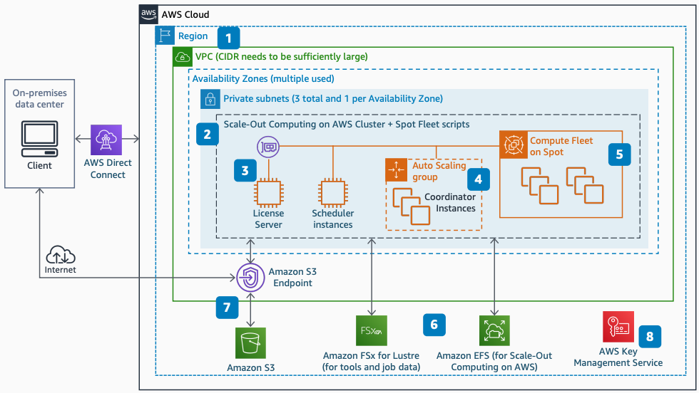

# Scaling Synopsys SiliconSmart on AWS: Deploy base architecture

Publication date: **April 1, 2021 ([Diagram history](#ss-step1-history "#ss-step1-history"))**

With this architecture, you can scale 100,000 or more concurrent Synopsys
SiliconSmart jobs by using Scale-Out Computing on AWS. This first step deploys the
base architecture by using [AWS CloudFormation](../../../AWSCloudFormation/latest/UserGuide.md "../../../AWSCloudFormation/latest/UserGuide.md").

## Step 1: Deploy the base architecture diagram

The following steps describe the deployment and configuration for this architecture:

1. Set up a Amazon VPC with private subnets and access from on-premises through
   AWS Direct Connect or AWS Site-to-Site VPN before launching Scale-Out Computing on AWS.
2. Deploy Scale-Out Computing on AWS as a baseline by using CloudFormation.
3. Enable license server access with one of two methods. Use the VM UUID (which is the
   AWS instance ID), or use an Elastic IP address attached to the instance.
4. Use AWS Auto Scaling groups for coordinator instances.
5. Use [Amazon EC2 Spot Fleet](../../../AWSEC2/latest/UserGuide/using-spot-instances.md "../../../AWSEC2/latest/UserGuide/using-spot-instances.md") to
   launch a compute fleet for running jobs.
6. Use POSIX-compliant file systems for the Scale-Out Computing on AWS environment.
   Use [Amazon Elastic File System](../../../efs/latest/ug.md "../../../efs/latest/ug.md") for cluster
   automation, and [FSx for Lustre](../../../fsx/latest/LustreGuide.md "../../../fsx/latest/LustreGuide.md") for SiliconSmart
   binaries and job data.
7. Move data to and from [Amazon Simple Storage Service](../../../AmazonS3/latest/userguide.md "../../../AmazonS3/latest/userguide.md") by using an Amazon S3 endpoint.
8. Enable encryption for intellectual property (IP) data and multiple AWS services by
   using [AWS KMS](../../../kms/latest/developerguide.md "../../../kms/latest/developerguide.md").

## Further reading

For additional information, see the following resources:

- [AWS Architecture Icons](https://aws.amazon.com/architecture/icons "https://aws.amazon.com/architecture/icons")
- [AWS Architecture Center](https://aws.amazon.com/architecture/ "https://aws.amazon.com/architecture/")
- [AWS
  Well-Architected](https://aws.amazon.com/architecture/well-architected "https://aws.amazon.com/architecture/well-architected")

## Diagram history

To receive updates about this reference architecture diagram, subscribe to the RSS
feed.

| Change                                                                                                                                   | Description                                     | Date          |
| ---------------------------------------------------------------------------------------------------------------------------------------- | ----------------------------------------------- | ------------- |
| Initial publication                                                                                                                      | Reference architecture diagram first published. | April 1, 2021 |
| [Initial publication](scaling-synopsys-siliconsmart-step2.md#ss-step2-history "scaling-synopsys-siliconsmart-step2.md#ss-step2-history") | Reference architecture diagram first published. | April 1, 2021 |
| [Initial publication](scaling-synopsys-siliconsmart-step3.md#ss-step3-history "scaling-synopsys-siliconsmart-step3.md#ss-step3-history") | Reference architecture diagram first published. | April 1, 2021 |

###### RSS subscription requirement

To subscribe to RSS updates, you must have an RSS plugin enabled for the browser you are
using.
