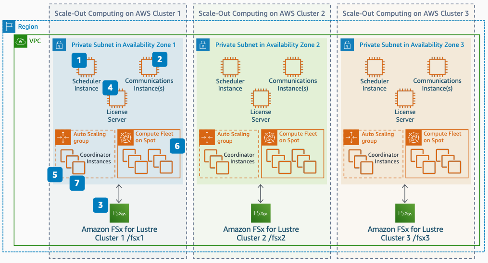

# Scaling Synopsys SiliconSmart on AWS: Scale out to multiple clusters

Publication date: **April 1, 2021 ([Diagram history](#ss-step2-history "#ss-step2-history"))**

With this architecture, you can scale the previous Scale-Out Computing on AWS deployment
to multiple clusters and Availability Zones. Limit total SiliconSmart jobs to
fewer than 40,000 for each scheduler instance and keep each cluster within the same Availability
Zone.

## Step 2: Scale out to multiple clusters diagram

The following steps describe the scale-out configuration for this architecture:

1. Limit total SiliconSmart jobs to fewer than 40,000 for each scheduler
   instance. Keep each cluster within the same Availability Zone.
2. Add 1 communication instance for every 1,000 compute instances. See Step 3 for tuning
   details.
3. Create an [FSx for Lustre](../../../fsx/latest/LustreGuide.md "../../../fsx/latest/LustreGuide.md") file system for each cluster in each
   Availability Zone. Move the data needed to run your jobs.
4. Launch a license server in each Availability Zone to reduce or eliminate
   inter-Availability Zone traffic.
5. Use the scheduler instance to launch SiliconSmart coordinators through
   an AWS Auto Scaling group. Scale to 50 or more coordinators.
6. Launch [Amazon Elastic Compute Cloud](../../../AWSEC2/latest/UserGuide.md "../../../AWSEC2/latest/UserGuide.md") instances in the compute fleet to meet
   the cores required by the coordinators.
7. Each coordinator invokes 500 to 2,000 job submissions by using `qsub`
   commands. Jobs then run on the compute fleet.

## Further reading

For additional information, see the following resources:

- [AWS Architecture Icons](https://aws.amazon.com/architecture/icons "https://aws.amazon.com/architecture/icons")
- [AWS Architecture Center](https://aws.amazon.com/architecture/ "https://aws.amazon.com/architecture/")
- [AWS
  Well-Architected](https://aws.amazon.com/architecture/well-architected "https://aws.amazon.com/architecture/well-architected")

## Diagram history

To receive updates about this reference architecture diagram, subscribe to the RSS
feed.

| Change                                                                                                                                   | Description                                     | Date          |
| ---------------------------------------------------------------------------------------------------------------------------------------- | ----------------------------------------------- | ------------- |
| [Initial publication](scaling-synopsys-siliconsmart-step1.md#ss-step1-history "scaling-synopsys-siliconsmart-step1.md#ss-step1-history") | Reference architecture diagram first published. | April 1, 2021 |
| Initial publication                                                                                                                      | Reference architecture diagram first published. | April 1, 2021 |
| [Initial publication](scaling-synopsys-siliconsmart-step3.md#ss-step3-history "scaling-synopsys-siliconsmart-step3.md#ss-step3-history") | Reference architecture diagram first published. | April 1, 2021 |

###### RSS subscription requirement

To subscribe to RSS updates, you must have an RSS plugin enabled for the browser you are
using.
