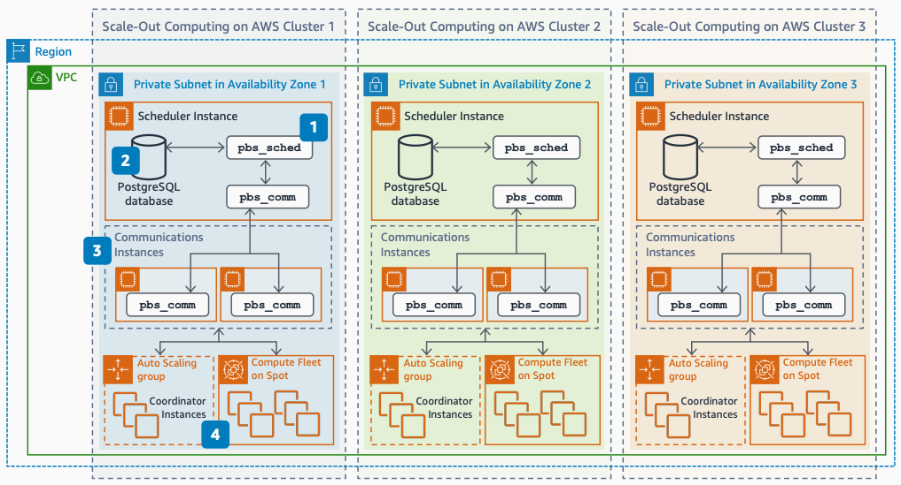

# Scaling Synopsys SiliconSmart on AWS: Tune PBS communication

Publication date: **April 1, 2021 ([Diagram history](#ss-step3-history "#ss-step3-history"))**

With this architecture, you can move the PBS Communication process from the PBS Scheduler to
multiple communication instances. This step tunes the scheduler and database configuration for
large-scale job execution.

## Step 3: Tune PBS communication diagram

The following steps describe the PBS tuning configuration for this architecture:

1. Increase the number of threads for the `pbs_sched` process. Use the
   maximum processes for each scheduler instance.
2. Tune the PostgreSQL database (for example, max memory, number of
   connections, processes).
3. Launch communication instances (which run the `pbs_comm` process) for every
   200 to 1,000 compute instances.
4. Update PBS configuration in coordinators and compute instances (in the AMI) to use
   multiple communication instances.

General recommendations:

- Create AMIs for the license manager, scheduler, communication nodes, and coordinators
  with all software and EDA base tooling baked in. This reduces ramp-up time.
- Reduce inter-Availability Zone traffic by keeping all components of a cluster within
  the same Availability Zone.
- Monitor throughput, IOPS, and metadata server operations to optimize file system
  performance.

## Further reading

For additional information, see the following resources:

- [AWS Architecture Icons](https://aws.amazon.com/architecture/icons "https://aws.amazon.com/architecture/icons")
- [AWS Architecture Center](https://aws.amazon.com/architecture/ "https://aws.amazon.com/architecture/")
- [AWS
  Well-Architected](https://aws.amazon.com/architecture/well-architected "https://aws.amazon.com/architecture/well-architected")

## Diagram history

To receive updates about this reference architecture diagram, subscribe to the RSS
feed.

| Change                                                                                                                                   | Description                                     | Date          |
| ---------------------------------------------------------------------------------------------------------------------------------------- | ----------------------------------------------- | ------------- |
| [Initial publication](scaling-synopsys-siliconsmart-step1.md#ss-step1-history "scaling-synopsys-siliconsmart-step1.md#ss-step1-history") | Reference architecture diagram first published. | April 1, 2021 |
| [Initial publication](scaling-synopsys-siliconsmart-step2.md#ss-step2-history "scaling-synopsys-siliconsmart-step2.md#ss-step2-history") | Reference architecture diagram first published. | April 1, 2021 |
| Initial publication                                                                                                                      | Reference architecture diagram first published. | April 1, 2021 |

###### RSS subscription requirement

To subscribe to RSS updates, you must have an RSS plugin enabled for the browser you are
using.
