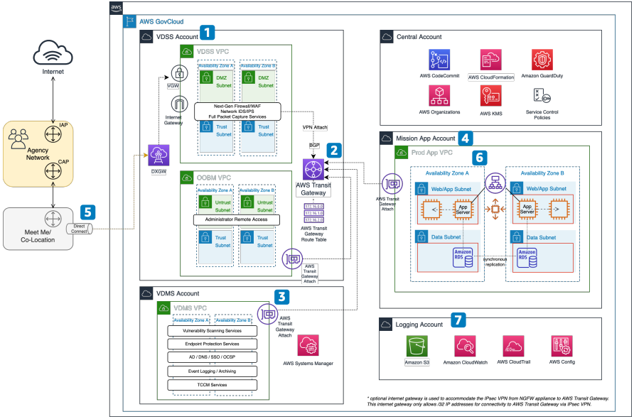

# Secure Cloud Computing Architecture (SCCA) on AWS GovCloud

Publication date: **June 20, 2022 ([Diagram history](#diagram-history "#diagram-history"))**

This architecture shows how to build a DISA-compliant landing zone on AWS GovCloud (US). You can run Department of Defense workloads in this environment.

## Secure Cloud Computing Architecture (SCCA) on AWS GovCloud

1. The Virtual Data Center Security Stack (VDSS) Account acts as the boundary for protection of mission owner applications.
2. AWS Transit Gateway acts as a hub that controls how traffic routes among all the connected networks, which act as spokes.
3. The Virtual Data Center Management Stack (VDMS) Account includes capabilities such as HBSS, ACAS, authentication systems, and other common services.
4. Core workloads deploy in the Mission App Account. All communications to and from the Mission App VPC transit the VDSS and consume shared services from the VDMS.
5. A Virtual Private Gateway (VGW) provides connectivity to the Department of Defense Information Network or other agency networks.
6. Typical multi-tier mission workloads use Elastic Load Balancing, AWS Auto Scaling Groups, and multiple Availability Zones for high availability and scalability.
7. The Logging Account represents the immutable location where logs aggregate and store.

## Further reading

For additional information, refer to

- [AWS Architecture Icons](https://aws.amazon.com/architecture/icons "https://aws.amazon.com/architecture/icons")
- [AWS Architecture Center](https://aws.amazon.com/architecture "https://aws.amazon.com/architecture")
- [AWS Well-Architected](https://aws.amazon.com/architecture/well-architected "https://aws.amazon.com/architecture/well-architected")
- [AWS GovCloud product page](https://aws.amazon.com/govcloud-us/ "https://aws.amazon.com/govcloud-us/")

## Diagram history

To be notified about updates to this reference architecture diagram, subscribe to the RSS feed.

| Change              | Description                                     | Date          |
| ------------------- | ----------------------------------------------- | ------------- |
| Initial publication | Reference architecture diagram first published. | June 20, 2022 |

###### Note

To subscribe to RSS updates, you must have an RSS plugin enabled for the browser you are using.
