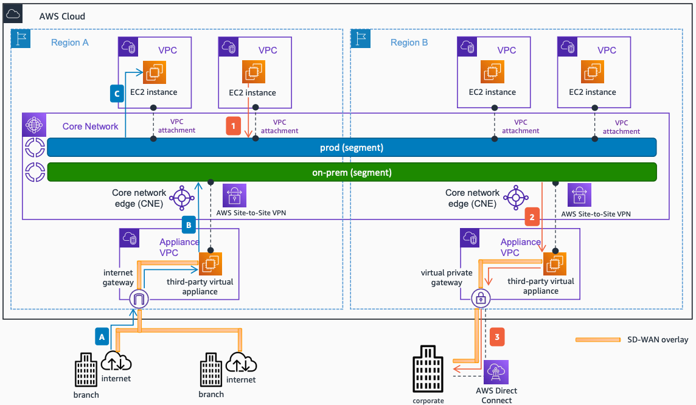

# SD-WAN Connectivity with AWS Site-to-Site VPN to AWS Cloud WAN

Publication date: **December 28, 2024 ([Diagram history](#sdwan5-diagram-history "#sdwan5-diagram-history"))**

If your third-party virtual appliance does not support GRE, you can still integrate your SD-WAN network to AWS Cloud WAN by creating an AWS Site-to-Site VPN connection, peering the SD-WAN headend with the [Transit Gateway](../../../vpc/latest/tgw/what-is-transit-gateway.md "../../../vpc/latest/tgw/what-is-transit-gateway.md") using IPSec tunnels. The SD-WAN headend can use BGP to peer with the Transit Gateway to exchange route prefixes. If you want to increase the bandwidth to more than the 1.25 Gbps limit of one single Site-to-Site VPN connection, additional IPSec VPN connections can be used with Cloud WAN's support for Equal-Cost Multi-Path (ECMP).

## SD-WAN connectivity with AWS Site-to-Site VPN to AWS Cloud WAN architecture

The following steps describe the AWS to on-premises traffic flow:

1. Traffic initiated from an Amazon Elastic Compute Cloud instance in a [Amazon VPC](../../../vpc/latest/userguide/what-is-amazon-vpc.md "../../../vpc/latest/userguide/what-is-amazon-vpc.md") in Region A and destined for the corporate data center is forwarded to the Core Network. The Amazon VPC attachment is associated to the prod segment.
2. As per the Core Network policy, traffic arriving to the prod segment destined to the corporate data center should be forwarded to the Site-to-Site VPN attachment in Region B. The traffic is routed between the Core Network and the third-party virtual appliance using the Site-to-Site VPN connection.
3. The third-party virtual appliance encapsulates the traffic, which uses the SD-WAN overlay (on top of the [AWS Direct Connect](../../../directconnect/latest/UserGuide/Welcome.md "../../../directconnect/latest/UserGuide/Welcome.md") link) to reach the corporate data center.

The following steps describe the on-premises to AWS traffic flow:

1. Traffic from branches outside AWS destined to a Amazon VPC in Region A reaches the internet gateway of the **appliance VPC** in that Region through the SD-WAN overlay - on top of the internet.
2. The third-party virtual appliance in the **appliance VPC** forwards the traffic to the Core Network through the Site-to-Site VPN connection.
3. As per the Core Network policy, the traffic is forwarded to the corresponding Amazon VPC, forwarding the traffic to the destination.

## Further reading

For additional information, see the following resources:

- [AWS Architecture Icons](https://aws.amazon.com/architecture/icons "https://aws.amazon.com/architecture/icons")
- [AWS Well-Architected](https://aws.amazon.com/architecture/well-architected "https://aws.amazon.com/architecture/well-architected")

## Diagram history

To be notified about updates to this reference architecture diagram, subscribe to the RSS feed.

| Change                                                                                                                           | Description                                     | Date              |
| -------------------------------------------------------------------------------------------------------------------------------- | ----------------------------------------------- | ----------------- |
| [Initial publication](sdwan-tgw-connect.md#sdwan1-diagram-history "sdwan-tgw-connect.md#sdwan1-diagram-history")                 | Reference architecture diagram first published. | December 28, 2024 |
| [Initial publication](sdwan-cloudwan-connect.md#sdwan2-diagram-history "sdwan-cloudwan-connect.md#sdwan2-diagram-history")       | Reference architecture diagram first published. | December 28, 2024 |
| [Initial publication](sdwan-cloudwan-tunnelless.md#sdwan3-diagram-history "sdwan-cloudwan-tunnelless.md#sdwan3-diagram-history") | Reference architecture diagram first published. | December 28, 2024 |
| [Initial publication](sdwan-vpn-tgw.md#sdwan4-diagram-history "sdwan-vpn-tgw.md#sdwan4-diagram-history")                         | Reference architecture diagram first published. | December 28, 2024 |
| Initial publication                                                                                                              | Reference architecture diagram first published. | December 28, 2024 |
| [Initial publication](sdwan-dx-tgw.md#sdwan6-diagram-history "sdwan-dx-tgw.md#sdwan6-diagram-history")                           | Reference architecture diagram first published. | December 28, 2024 |
| [Initial publication](sdwan-dx-cloudwan.md#sdwan7-diagram-history "sdwan-dx-cloudwan.md#sdwan7-diagram-history")                 | Reference architecture diagram first published. | December 28, 2024 |

###### Note

To subscribe to RSS updates, you must have an RSS plugin enabled for the browser you are using.
