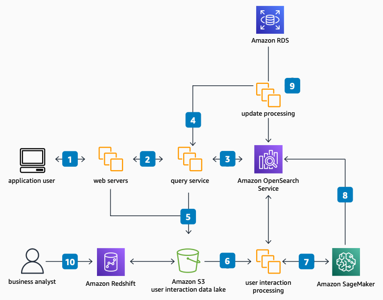

# Search-Backed Applications

Publication date: **November 17, 2022 ([Diagram history](#diagram-history "#diagram-history"))**

This architecture outlines the process to add or improve search for an existing application. It uses [Amazon OpenSearch Service](../../../opensearch-service/latest/developerguide/what-is.md "../../../opensearch-service/latest/developerguide/what-is.md") for indexing and retrieval, [SageMaker AI](../../../sagemaker/latest/dg/whatis.md "../../../sagemaker/latest/dg/whatis.md") for ML enrichment, and [Amazon Simple Storage Service](../../../AmazonS3/latest/userguide/Welcome.md "../../../AmazonS3/latest/userguide/Welcome.md") for user interaction data storage.

## Search-Backed Applications

The following steps describe the architecture:

1. An application user sends a query to the web servers.
2. The web servers deliver the query to the query service. The query service can use ML models from SageMaker AI for user segmentation, concept and entity extraction, and query-to-click analysis.
3. The query service enriches or rewrites the query based on user segmentation from SageMaker AI, user preferences from [Amazon RDS](../../../AmazonRDS/latest/UserGuide/Welcome.md "../../../AmazonRDS/latest/UserGuide/Welcome.md"), and past query performance. It sends the augmented query to Amazon OpenSearch Service.
4. The user sends only searchable data to Amazon OpenSearch Service, using a relational or NoSQL system as the system of record. The query service retrieves only keys in the search results and fetches the full record from the system of record.
5. The web servers and query service send user interaction data to an Amazon S3 data lake or [Amazon Redshift](../../../redshift/latest/dg/welcome.md "../../../redshift/latest/dg/welcome.md").
6. An offline process pulls user interaction data from the data lake.
7. The offline process takes data such as clicks to augment the records in the catalog and updates models in SageMaker AI.
8. Records are updated in Amazon OpenSearch Service as needed.
9. The web servers send catalog updates to Amazon OpenSearch Service, or a change data capture process brings those updates to Amazon OpenSearch Service.
10. Business analysts generate reporting and KPIs from the processed user interactions.

## Further reading

For additional information, refer to the following resources:

- [AWS Architecture Icons](https://aws.amazon.com/architecture/icons "https://aws.amazon.com/architecture/icons")
- [AWS Architecture Center](https://aws.amazon.com/architecture "https://aws.amazon.com/architecture")
- [AWS Well-Architected](https://aws.amazon.com/architecture/well-architected "https://aws.amazon.com/architecture/well-architected")

## Diagram history

To be notified about updates to this reference architecture diagram, subscribe to the RSS feed.

| Change              | Description                                     | Date              |
| ------------------- | ----------------------------------------------- | ----------------- |
| Initial publication | Reference architecture diagram first published. | November 17, 2022 |

###### Note

To subscribe to RSS updates, you must have an RSS plugin enabled for the browser you are using.
