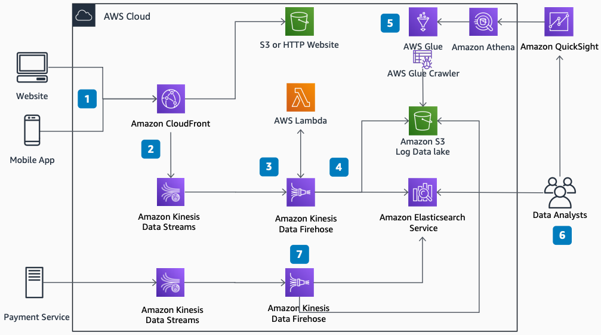

# Search and Booking Metrics in Travel and Hospitality

Publication date: **October 15, 2020 ([Diagram history](#sbm-history "#sbm-history"))**

With this architecture, you can build a content delivery network (CDN) platform for
customer-facing websites to gather traffic data in real time. Understand search and purchase
patterns through enriched analytics data. The solution presents real-time data in [Amazon OpenSearch Service](../../../opensearch-service/latest/developerguide.md "../../../opensearch-service/latest/developerguide.md") and
historical and aggregated data in [Amazon Quick Sight](../../../quicksight/latest/developerguide/welcome.md "../../../quicksight/latest/developerguide/welcome.md").

## Search and booking metrics diagram

The following steps describe the architecture:

1. Website users search for availability on the website served through [Amazon CloudFront](../../../AmazonCloudFront/latest/DeveloperGuide.md "../../../AmazonCloudFront/latest/DeveloperGuide.md").
2. CloudFront sends the request log to an [Amazon Kinesis](../../../kinesis/latest/dev.md "../../../kinesis/latest/dev.md") Data Streams in real time.
3. Amazon Data Firehose extracts data from the Kinesis data stream for processing and
   delivery. [AWS Lambda](../../../lambda/latest/dg.md "../../../lambda/latest/dg.md") maps the
   log properties to their respective tags such as IP, headers, and cookies.
4. Amazon Data Firehose delivers the transformed logs as JSON to an [Amazon Simple Storage Service](../../../AmazonS3/latest/userguide.md "../../../AmazonS3/latest/userguide.md") data lake and
   an Amazon OpenSearch Service cluster.
5. An [AWS Glue](../../../glue/latest/dg.md "../../../glue/latest/dg.md") crawler runs on
   a schedule, deriving a schema from the data. It updates a Data Catalog in [Amazon Athena](../../../athena/latest/ug.md "../../../athena/latest/ug.md").
6. As new purchases happen, the cookie header or session ID value and purchase
   information flow to the data lake and Amazon OpenSearch Service cluster.
7. Data analysts visualize historical and aggregated data through Amazon Quick Sight. They view
   real-time data in Amazon OpenSearch Service.

## Further reading

For additional information, see the following resources:

- [AWS Architecture Icons](https://aws.amazon.com/architecture/icons "https://aws.amazon.com/architecture/icons")
- [AWS Architecture Center](https://aws.amazon.com/architecture/ "https://aws.amazon.com/architecture/")
- [AWS
  Well-Architected](https://aws.amazon.com/architecture/well-architected "https://aws.amazon.com/architecture/well-architected")

## Diagram history

To receive updates about this reference architecture diagram, subscribe to the RSS
feed.

| Change              | Description                                     | Date             |
| ------------------- | ----------------------------------------------- | ---------------- |
| Initial publication | Reference architecture diagram first published. | October 15, 2020 |

###### RSS subscription requirement

To subscribe to RSS updates, you must have an RSS plugin enabled for the browser you are
using.
