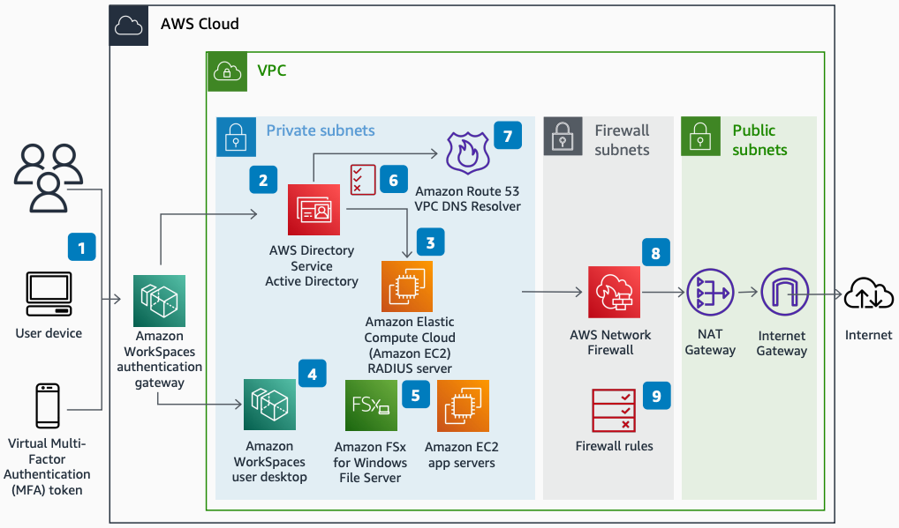

# Secure Remote Worker Environment

Publication date: **January 31, 2022 ([Diagram history](#diagram-history "#diagram-history"))**

This architecture shows how to build a secure desktop environment for remote workers. Workers can access key line-of-business applications and data.

## Secure Remote Worker Environment

1. Users connect to their desktop by using the [Amazon WorkSpaces](../../../workspaces/latest/adminguide/amazon-workspaces.md "../../../workspaces/latest/adminguide/amazon-workspaces.md") application with a username, password, and MFA code.
2. The Amazon WorkSpaces authentication gateway authenticates against [Amazon DynamoDB Streams](../../../directoryservice/latest/admin-guide/what_is.md "../../../directoryservice/latest/admin-guide/what_is.md").
3. The MFA code authenticates against the MFA service's RADIUS server (for example, OneLogin).
4. Users connect to their desktop through Amazon WorkSpaces.
5. Users access core systems and files hosted on [Amazon Elastic Compute Cloud](../../../AWSEC2/latest/UserGuide/concepts.md "../../../AWSEC2/latest/UserGuide/concepts.md") and [Amazon FSx](../../../fsx/latest/WindowsGuide/what-is.md "../../../fsx/latest/WindowsGuide/what-is.md").
6. Group policy in Active Directory prevents unwanted activities, such as printing to local printers from Amazon WorkSpaces.
7. Domain Controller DNS forwards to Route 53 VPC DNS resolver with applied Route 53 Resolver DNS Firewall rules.
8. [AWS Network Firewall](../../../network-firewall/latest/developerguide/what-is-aws-network-firewall.md "../../../network-firewall/latest/developerguide/what-is-aws-network-firewall.md") filters outbound internet traffic, then routes it through a NAT gateway and internet gateway to the public internet.
9. Firewall rules block outbound traffic to unwanted sites (such as file-sharing platforms) to prevent data leaks.

## Further reading

For additional information, refer to

- [AWS Architecture Icons](https://aws.amazon.com/architecture/icons "https://aws.amazon.com/architecture/icons")
- [AWS Architecture Center](https://aws.amazon.com/architecture "https://aws.amazon.com/architecture")
- [AWS Well-Architected](https://aws.amazon.com/architecture/well-architected "https://aws.amazon.com/architecture/well-architected")
- [Amazon WorkSpaces product page](https://aws.amazon.com/workspaces/ "https://aws.amazon.com/workspaces/")

## Diagram history

To be notified about updates to this reference architecture diagram, subscribe to the RSS feed.

| Change              | Description                                     | Date             |
| ------------------- | ----------------------------------------------- | ---------------- |
| Initial publication | Reference architecture diagram first published. | January 31, 2022 |

###### Note

To subscribe to RSS updates, you must have an RSS plugin enabled for the browser you are using.
