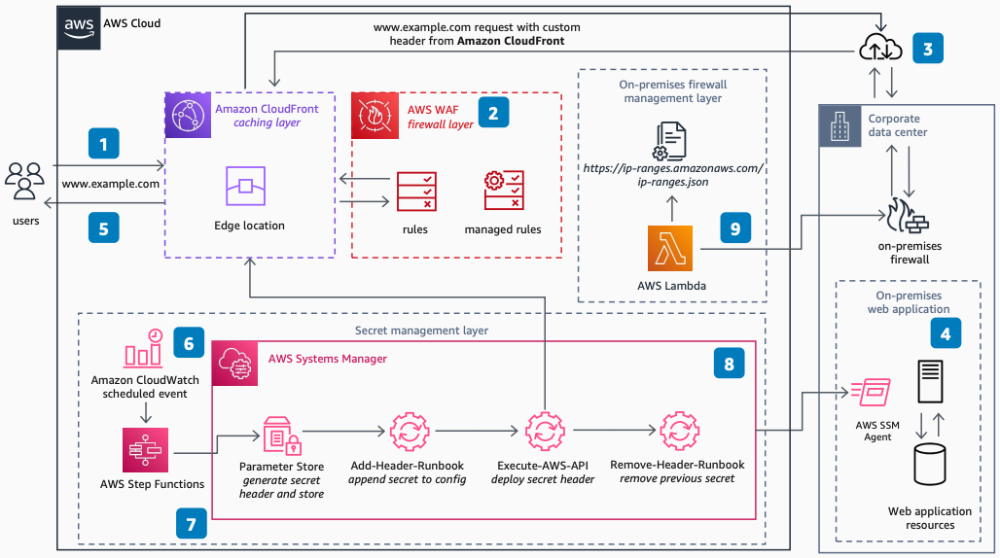

# Securing Custom Origins with AWS WAF

Publication date: **July 26, 2022 ([Diagram history](#diagram-history "#diagram-history"))**

This architecture shows how to protect any endpoint against common web vulnerabilities. You use AWS WAF with custom origins and custom secret headers in Amazon CloudFront.

## Securing Custom Origins with AWS WAF

1. Users make a request to the web application. DNS records direct the user to the closest CloudFront edge location.
2. AWS WAF inspects the traffic by using both custom and managed rules. It checks for common web exploit attacks. AWS WAF logs traffic for future analysis and can block malicious traffic.
3. CloudFront injects a secret custom header into the request and redirects it to the on-premises web application.
4. The web application drops or blocks any request without the secret custom header. This ensures AWS WAF inspects all traffic.
5. Users receive the response to their request from CloudFront. Data caches at the edge location for the next request.
6. An [Step Functions](../../../step-functions/latest/dg/welcome.md "../../../step-functions/latest/dg/welcome.md") workflow orchestrates the secret header rotation and deployment process on a configurable schedule.
7. The Step Functions workflow generates a new secret for the custom header value. It stores the value in [AWS Systems Manager](../../../systems-manager/latest/userguide/what-is-systems-manager.md "../../../systems-manager/latest/userguide/what-is-systems-manager.md") Parameter Store.
8. The new header value is distributed to one or more web app servers through [SSM](../../../systems-manager/latest/userguide/what-is-systems-manager.md "../../../systems-manager/latest/userguide/what-is-systems-manager.md") Agent and Automation Runbooks. After finalization, the workflow deploys the new header to CloudFront.
9. The on-premises firewall updates to allow only CloudFront IP addresses to the web application as an additional protection layer.

## Further reading

For additional information, refer to

- [AWS Architecture Icons](https://aws.amazon.com/architecture/icons "https://aws.amazon.com/architecture/icons")
- [AWS Architecture Center](https://aws.amazon.com/architecture "https://aws.amazon.com/architecture")
- [AWS Well-Architected](https://aws.amazon.com/architecture/well-architected "https://aws.amazon.com/architecture/well-architected")
- [AWS WAF product page](https://aws.amazon.com/waf/ "https://aws.amazon.com/waf/")

## Diagram history

To be notified about updates to this reference architecture diagram, subscribe to the RSS feed.

| Change              | Description                                     | Date          |
| ------------------- | ----------------------------------------------- | ------------- |
| Initial publication | Reference architecture diagram first published. | July 26, 2022 |

###### Note

To subscribe to RSS updates, you must have an RSS plugin enabled for the browser you are using.
