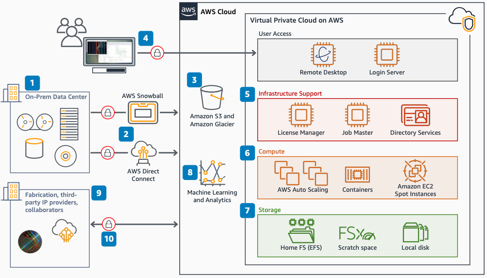

# Semiconductor and Electronics on AWS

Publication date: **February 21, 2020 ([Diagram history](#semi-history "#semi-history"))**

With this architecture, you can run semiconductor design workflows on AWS. The solution
provides an overview of AWS services and data movement options for design compute, storage,
remote access, and security. You can also collaborate with fabrication partners and third-party
IP providers.

## Semiconductor and electronics on AWS diagram

The following steps describe the data flow and key configuration points for this
architecture:

1. Determine what data you need for your proof of concept or test.
2. Transfer data into AWS by using [AWS Snowball Edge](../../../snowball/latest/developer-guide.md "../../../snowball/latest/developer-guide.md"), AWS Direct Connect, or
   other AWS services.
3. Store transferred data in [Amazon Simple Storage Service](../../../AmazonS3/latest/userguide.md "../../../AmazonS3/latest/userguide.md") buckets. Access data stored in Amazon S3
   from an [Amazon Elastic Compute Cloud](../../../AWSEC2/latest/UserGuide.md "../../../AWSEC2/latest/UserGuide.md")
   instance or nearly any AWS service.
4. Access your environment through a remote desktop session or command line
   (SSH).
5. Use all of the infrastructure needed for semiconductor design workflows on
   AWS.
6. Use AWS flexible and robust compute to run semiconductor design workflows.
7. Store tools and job data on [Amazon Elastic File System](../../../efs/latest/ug.md "../../../efs/latest/ug.md"), [FSx for Lustre](../../../fsx/latest/LustreGuide.md "../../../fsx/latest/LustreGuide.md"), and local disk. (Optional) Move
   long-term data to Amazon S3.
8. Use other AWS services such as data lakes, artificial intelligence and machine
   learning (AI/ML), and analytics after your data is in AWS.
9. Isolate environments to enhance security and limit third parties to only the data
   they need.
10. Enable encryption everywhere by using [AWS KMS](../../../kms/latest/developerguide.md "../../../kms/latest/developerguide.md") with your keys.

## Further reading

For additional information, see the following resources:

- [AWS Architecture Icons](https://aws.amazon.com/architecture/icons "https://aws.amazon.com/architecture/icons")
- [AWS Architecture Center](https://aws.amazon.com/architecture/ "https://aws.amazon.com/architecture/")
- [AWS
  Well-Architected](https://aws.amazon.com/architecture/well-architected "https://aws.amazon.com/architecture/well-architected")

## Diagram history

To receive updates about this reference architecture diagram, subscribe to the RSS
feed.

| Change              | Description                                     | Date              |
| ------------------- | ----------------------------------------------- | ----------------- |
| Initial publication | Reference architecture diagram first published. | February 21, 2020 |

###### RSS subscription requirement

To subscribe to RSS updates, you must have an RSS plugin enabled for the browser you are
using.
