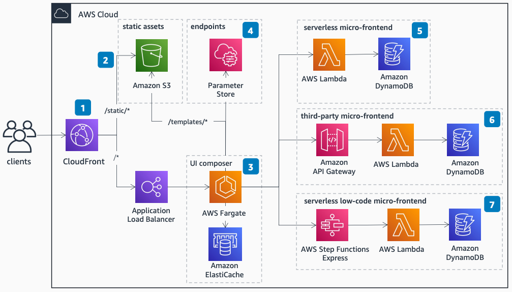

# Server-Side Rendering Micro-Frontends in AWS

Publication date: **September 9, 2022 ([Diagram history](#diagram-history "#diagram-history"))**

This architecture shows how to implement server-side rendering micro-frontends in AWS using a serverless approach. Every serverless micro-frontend returns an HTML fragment (HTML-on-the-wire), and a UI composer stitches together these independent parts to create a seamless experience for users.

## Server-Side Rendering Micro-Frontends in AWS

The following steps describe the architecture:

1. [Amazon CloudFront](../../../AmazonCloudFront/latest/DeveloperGuide/Introduction.md "../../../AmazonCloudFront/latest/DeveloperGuide/Introduction.md") serves as the entry point with two origins: an [Amazon Simple Storage Service](../../../AmazonS3/latest/userguide/Welcome.md "../../../AmazonS3/latest/userguide/Welcome.md") bucket and a public Application Load Balancer.
2. The Amazon S3 bucket contains all static files for the browser such as common micro-frontend dependencies, images, and CSS files. It also contains the templates the UI composer uses to place every micro-frontend on an HTML page.
3. The UI composer runs on an [AWS Fargate](../../../AmazonECS/latest/developerguide/AWS_Fargate.md "../../../AmazonECS/latest/developerguide/AWS_Fargate.md") cluster and stitches together different micro-frontends, streaming the response to improve performance. Use [Amazon ElastiCache](../../../AmazonElastiCache/latest/red-ug/WhatIs.md "../../../AmazonElastiCache/latest/red-ug/WhatIs.md") to cache micro-frontend output or entire pages for additional performance gains.
4. Use [AWS Systems Manager](../../../systems-manager/latest/userguide/what-is-systems-manager.md "../../../systems-manager/latest/userguide/what-is-systems-manager.md") Parameter Store to collect all micro-service endpoints. They can be HTTP endpoints or Amazon Resource Names (ARNs), decoupling team-level dependencies.
5. A serverless micro-frontend uses [AWS Lambda](../../../lambda/latest/dg/welcome.md "../../../lambda/latest/dg/welcome.md") and [Amazon DynamoDB](../../../amazondynamodb/latest/developerguide/Introduction.md "../../../amazondynamodb/latest/developerguide/Introduction.md") to store data and render an HTML fragment ready for embedding in the UI composer template.
6. For third-party micro-frontends, use [Amazon API Gateway](../../../apigateway/latest/developerguide/welcome.md "../../../apigateway/latest/developerguide/welcome.md") to validate tokens or API keys, ensuring only your application can access that endpoint.
7. Use [AWS Step Functions](../../../step-functions/latest/dg/welcome.md "../../../step-functions/latest/dg/welcome.md") Express as a low-code solution for generating micro-frontends. Step Functions integrates with over 200 services to reduce computation, retrieves data from DynamoDB natively, and delegates rendering to a Lambda function.

## Further reading

For additional information, refer to the following resources:

- [AWS Architecture Icons](https://aws.amazon.com/architecture/icons "https://aws.amazon.com/architecture/icons")
- [AWS Architecture Center](https://aws.amazon.com/architecture "https://aws.amazon.com/architecture")
- [AWS Well-Architected](https://aws.amazon.com/architecture/well-architected "https://aws.amazon.com/architecture/well-architected")

## Diagram history

To be notified about updates to this reference architecture diagram, subscribe to the RSS feed.

| Change              | Description                                     | Date              |
| ------------------- | ----------------------------------------------- | ----------------- |
| Initial publication | Reference architecture diagram first published. | September 9, 2022 |

###### Note

To subscribe to RSS updates, you must have an RSS plugin enabled for the browser you are using.
