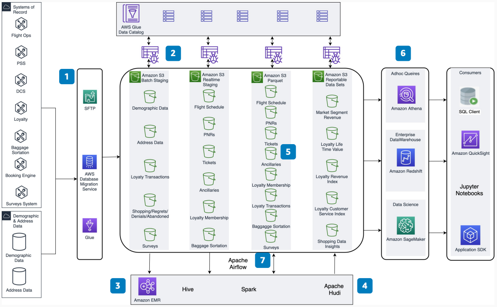

# Managing Inserts and Upserts in a Serverless Data Lake

Publication date: **June 15, 2021 ([Diagram history](#diagram-history "#diagram-history"))**

This architecture shows how to use Apache Hudi running on Amazon EMR to process inserts and updates to datasets in [Amazon Simple Storage Service](../../../AmazonS3/latest/userguide/Welcome.md "../../../AmazonS3/latest/userguide/Welcome.md"). You can build a cost-effective and scalable data lake that provisions on-demand analytics and creates persistent data marts.

## Managing Inserts and Upserts in a Serverless Data Lake

The following steps describe the architecture:

1. Ingest data from source systems using batch, change data capture (CDC), or streaming into the raw layer in Amazon S3.
2. After the data persists in the raw data lake on Amazon S3, crawl the data and populate it in the [AWS Glue](../../../glue/latest/dg/what-is-glue.md "../../../glue/latest/dg/what-is-glue.md") Data Catalog using a crawler.
3. Pull raw data into an Amazon EMR cluster and read it using Hive and Spark for cleaning and transformation.
4. Apache Hudi running on Amazon EMR reads the data using Spark APIs and performs inserts and upserts on the required datasets.
5. Persist the cleaned and transformed data back into the Amazon S3 processed and reportable buckets.
6. Consume the reportable data on demand using [Athena](../../../athena/latest/ug/what-is.md "../../../athena/latest/ug/what-is.md") or load it into [Amazon Redshift](../../../redshift/latest/dg/welcome.md "../../../redshift/latest/dg/welcome.md"). Different users, tools, and resources can consume this data.
7. Handle the complete data movement, spin on-demand Amazon EMR clusters for batch data, and load the data using workflow orchestration with Amazon Managed Workflows for Apache Airflow (MWAA).

## Further reading

For additional information, refer to the following resources:

- [AWS Architecture Icons](https://aws.amazon.com/architecture/icons "https://aws.amazon.com/architecture/icons")
- [AWS Architecture Center](https://aws.amazon.com/architecture "https://aws.amazon.com/architecture")
- [AWS Well-Architected](https://aws.amazon.com/architecture/well-architected "https://aws.amazon.com/architecture/well-architected")

## Diagram history

To be notified about updates to this reference architecture diagram, subscribe to the RSS feed.

| Change              | Description                                     | Date          |
| ------------------- | ----------------------------------------------- | ------------- |
| Initial publication | Reference architecture diagram first published. | June 15, 2021 |

###### Note

To subscribe to RSS updates, you must have an RSS plugin enabled for the browser you are using.
