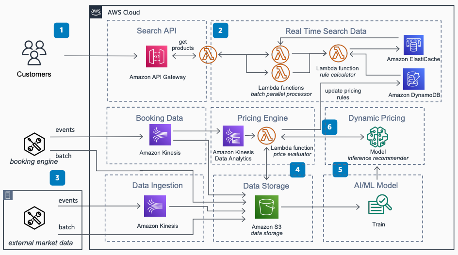

# Serverless Strategy for Dynamic Pricing

Publication date: **June 28, 2021 ([Diagram history](#diagram-history "#diagram-history"))**

This architecture shows a serverless strategy for dynamic pricing. For bookings based on date ranges, you can build prices in parallel and dynamically calculate them based on factors such as date, duration, and number of people. You then display sorted comparable products with sub-second response times, and update prices based on current market conditions.

## Serverless Strategy for Dynamic Pricing

The following steps describe the architecture:

1. You provide search input to obtain a sorted list of products filtered by price and other attributes. Data is sent through [Amazon API Gateway](../../../apigateway/latest/developerguide/welcome.md "../../../apigateway/latest/developerguide/welcome.md") which calls multiple [AWS Lambda](../../../lambda/latest/dg/welcome.md "../../../lambda/latest/dg/welcome.md") functions to process pricing requests in parallel for real-time price lookups.
2. The batch parallel processor Lambda functions call the rule calculator function to get the latest product rules from [Amazon DynamoDB](../../../amazondynamodb/latest/developerguide/Introduction.md "../../../amazondynamodb/latest/developerguide/Introduction.md"). The product is calculated against the search ID and stored in [Amazon ElastiCache](../../../AmazonElastiCache/latest/red-ug/WhatIs.md "../../../AmazonElastiCache/latest/red-ug/WhatIs.md"). After the batch functions complete, all results for the search ID are returned from the cache.
3. Historical data from the booking engine and external market data provide information so the pricing engine has sufficient data to update pricing in real time.
4. The booking engine events are captured and monitored on [Amazon Kinesis](../../../streams/latest/dev/introduction.md "../../../streams/latest/dev/introduction.md"). Amazon Kinesis Data Analytics queries the data stream and triggers the price evaluator Lambda function if a change is detected. Events are stored in [Amazon Simple Storage Service](../../../AmazonS3/latest/userguide/Welcome.md "../../../AmazonS3/latest/userguide/Welcome.md") with supporting historical batch data.
5. An [Amazon SageMaker AI](../../../sagemaker/latest/dg/whatis.md "../../../sagemaker/latest/dg/whatis.md") Train model uses historic booking data and augmented historic data to train the model for pricing recommendations.
6. Using an SageMaker AI inference recommender model, the pricing engine gets new price recommendations based on market conditions.

## Further reading

For additional information, refer to the following resources:

- [AWS Architecture Icons](https://aws.amazon.com/architecture/icons "https://aws.amazon.com/architecture/icons")
- [AWS Architecture Center](https://aws.amazon.com/architecture "https://aws.amazon.com/architecture")
- [AWS Well-Architected](https://aws.amazon.com/architecture/well-architected "https://aws.amazon.com/architecture/well-architected")

## Diagram history

To be notified about updates to this reference architecture diagram, subscribe to the RSS feed.

| Change              | Description                                     | Date          |
| ------------------- | ----------------------------------------------- | ------------- |
| Initial publication | Reference architecture diagram first published. | June 28, 2021 |

###### Note

To subscribe to RSS updates, you must have an RSS plugin enabled for the browser you are using.
