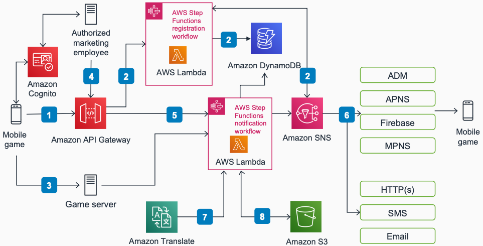

# Serverless Notifications for Mobile Games with Step Functions

Publication date: **March 10, 2021 ([Diagram history](#notif-sf-history "#notif-sf-history"))**

This architecture creates a serverless data flow to ingest, store, process, and send push
notifications to subscribers. Use this pipeline for flash offers, in-game event notifications,
and campaign-specific notifications targeting segmented audiences with efficiency tracking.

## Serverless Notifications with Step Functions diagram

The following steps describe the architecture:

1. When the game client launches, it sends registration information to an [Amazon API Gateway](../../../apigateway/latest/developerguide.md "../../../apigateway/latest/developerguide.md") REST
   endpoint. The game client can also send direct notification information through REST.
2. API Gateway requests the [AWS Step Functions](../../../step-functions/latest/dg.md "../../../step-functions/latest/dg.md") registration flow that performs
   additional logic like device registration and storing [Amazon Simple Notification Service](../../../sns/latest/dg.md "../../../sns/latest/dg.md") endpoint data in [Amazon DynamoDB](../../../amazondynamodb/latest/developerguide.md "../../../amazondynamodb/latest/developerguide.md").
3. As the game client sends information to the game server, the server triggers the
   Step Functions notification workflow that processes messages.
4. To run campaigns or send single notifications, a marketing employee can also manually
   request the Lambda Step Functions flow through API Gateway. Authorization is handled through [Amazon Cognito](../../../cognito/latest/developerguide.md "../../../cognito/latest/developerguide.md").
5. The notification flow performs actions like translation (by using [Amazon Translate](../../../translate/latest/dg/what-is.md "../../../translate/latest/dg/what-is.md")),
   message payload enrichment, and storing and obtaining endpoint data from DynamoDB. This data
   defines direct users or segments to send messages to.
6. Step Functions uses Amazon Translate for quick translation of notification content.
7. Amazon SNS uses the push notification service credentials and mobile device tokens. After
   receiving the message, all topic subscribers receive the push notification through
   providers like Firebase or Apple push notification
   service.
8. Raw data is sent to [Amazon Simple Storage Service](../../../AmazonS3/latest/userguide.md "../../../AmazonS3/latest/userguide.md") for cold data analytics.

## Further reading

For additional information, see the following resources:

- [AWS Architecture Icons](https://aws.amazon.com/architecture/icons "https://aws.amazon.com/architecture/icons")
- [AWS Architecture Center](https://aws.amazon.com/architecture/ "https://aws.amazon.com/architecture/")
- [AWS
  Well-Architected](https://aws.amazon.com/architecture/well-architected "https://aws.amazon.com/architecture/well-architected")

## Diagram history

To be notified about updates to this reference architecture diagram, subscribe to the RSS
feed.

| Change                                                                                                                                 | Description                                     | Date           |
| -------------------------------------------------------------------------------------------------------------------------------------- | ----------------------------------------------- | -------------- |
| Initial publication                                                                                                                    | Reference architecture diagram first published. | March 10, 2021 |
| [Initial publication](serverless-notifications-pinpoint.md#notif-pin-history "serverless-notifications-pinpoint.md#notif-pin-history") | Reference architecture diagram first published. | March 10, 2021 |

###### Note

To subscribe to RSS updates, you must have an RSS plugin enabled for the browser you are
using.
