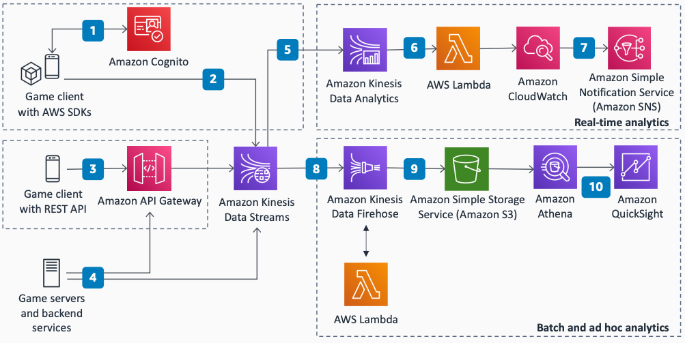

# Serverless Real-Time Analytics for Games

Publication date: **August 9, 2021 ([Diagram history](#analytics-history "#analytics-history"))**

This serverless architecture collects events from games, analyzes them in real-time, and
stores them for batch analysis. You can use this pipeline to provide real-time flash offers,
monitor user acquisition campaigns, detect abusive players, find deficiencies during A/B
testing, and build online dashboards for business and operational metrics.

## Serverless Real-Time Analytics for Games diagram

**Collecting client events (option with AWS SDKs):**

1. The game uses an AWS SDK to submit events in JSON directly to [Amazon Kinesis Data Streams](../../../streams/latest/dev.md "../../../streams/latest/dev.md"). The
   SDK used depends on the game engine. If the game engine is Unity, you can
   use the AWS SDK for .NET. If the game engine is Unreal Engine, you can
   use the AWS SDK for C++.
2. The game receives temporary AWS credentials from the [Amazon Cognito](../../../cognito/latest/developerguide.md "../../../cognito/latest/developerguide.md") identity pool to access Kinesis
   Data Streams.

**Collecting client events (option without AWS SDK):**

3. The game submits events through the REST API to [Amazon API Gateway](../../../apigateway/latest/developerguide.md "../../../apigateway/latest/developerguide.md"), which has a native
   integration with Kinesis. This option adds an extra layer of separation between the player
   and the Kinesis Data Stream through a REST API and does not require Amazon Cognito.

**Submitting server events:**

4. Multiplayer game servers, backend servers, and other services can submit events
   directly to Kinesis by using the AWS SDK, or through API Gateway. When possible, submit events
   from an authoritative server.

**Processing and analyzing real-time events:**

5. Amazon Managed Service for Apache Flink consumes data from the Kinesis
   Data Stream instance. It runs real-time SQL queries on the stream to analyze, filter, and
   process data.
6. The data is processed by a [AWS Lambda](../../../lambda/latest/dg.md "../../../lambda/latest/dg.md") function, which sends custom metrics to [Amazon CloudWatch](../../../AmazonCloudWatch/latest/monitoring.md "../../../AmazonCloudWatch/latest/monitoring.md").
7. The custom CloudWatch metrics are visualized in a real-time dashboard. You can create an
   operational dashboard that shows infrastructure health, and a game events dashboard that
   shows real-time game KPIs such as concurrent users. You can create alerts and notifications
   through CloudWatch and Amazon SNS.

**Storing events for batch analysis:**

8. Amazon Data Firehose consumes the data stream and preprocesses the data for storage by
   using a built-in Lambda integration. For example, you can transform the data to
   Parquet format. Parquet is compressed and optimized for
   performance and lower storage costs when running analytics.
9. Processed data is batched and stored in [Amazon Simple Storage Service](../../../AmazonS3/latest/userguide.md "../../../AmazonS3/latest/userguide.md") to create a game analytics data lake.
   Use S3 Intelligent-Tiering, lifecycle policies, and different storage tiers for cost
   savings on historical data.

**Visualizing batch data:**

10. Query data on an ad hoc basis by using Amazon Athena. Visualize the data to get
    business insights by using Amazon Quick Sight.

## Further reading

For additional information, see the following resources:

- [AWS Architecture Icons](https://aws.amazon.com/architecture/icons "https://aws.amazon.com/architecture/icons")
- [AWS Architecture Center](https://aws.amazon.com/architecture/ "https://aws.amazon.com/architecture/")
- [AWS
  Well-Architected](https://aws.amazon.com/architecture/well-architected "https://aws.amazon.com/architecture/well-architected")

## Diagram history

To be notified about updates to this reference architecture diagram, subscribe to the RSS
feed.

| Change              | Description                                     | Date           |
| ------------------- | ----------------------------------------------- | -------------- |
| Initial publication | Reference architecture diagram first published. | August 9, 2021 |

###### Note

To subscribe to RSS updates, you must have an RSS plugin enabled for the browser you are
using.
