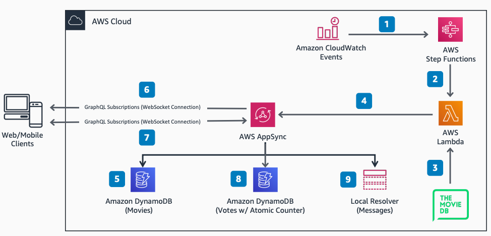

# Serverless Web App Real-Time Data Broadcasting

Publication date: **March 24, 2021 ([Diagram history](#diagram-history "#diagram-history"))**

This architecture shows how to create a movie voting application using [AWS AppSync](../../../appsync/latest/devguide/what-is-appsync.md "../../../appsync/latest/devguide/what-is-appsync.md"), [AWS Lambda](../../../lambda/latest/dg/welcome.md "../../../lambda/latest/dg/welcome.md"), [AWS Step Functions](../../../step-functions/latest/dg/welcome.md "../../../step-functions/latest/dg/welcome.md"), and [Amazon DynamoDB](../../../amazondynamodb/latest/developerguide/Introduction.md "../../../amazondynamodb/latest/developerguide/Introduction.md"). You can use backend and client-facing real-time broadcasting with managed GraphQL subscriptions over WebSockets.

## Serverless Web App Real-Time Data Broadcasting

The following steps describe the architecture:

1. [Amazon CloudWatch](../../../AmazonCloudWatch/latest/monitoring/WhatIsCloudWatch.md "../../../AmazonCloudWatch/latest/monitoring/WhatIsCloudWatch.md") Events initiates a workflow in Step Functions every 60 seconds.
2. Step Functions triggers Lambda every 10 seconds.
3. Lambda calls The Movie DB API to retrieve metadata for a single random movie from the most popular movies list.
4. Lambda updates the Movie table, zeroes current votes, and upvotes the leaderboard in the Votes table through GraphQL mutations to AppSync.
5. AppSync updates the Movie table in DynamoDB with the single current movie retrieved from Lambda.
6. All connected clients subscribed to the backend mutation see the same current movie poster and synopsis on screen through the broadcast.
7. Clients vote on the current movie during a 10-second window, and can send and receive chat messages in a public chatroom.
8. Lambda updates the leaderboard and client movie votes through AppSync mutations.
9. The public chatroom displays current messages on a pub/sub channel through Local Resolver. Messages are not persisted on backend storage, and only new messages are displayed.

## Further reading

For additional information, refer to the following resources:

- [AWS Architecture Icons](https://aws.amazon.com/architecture/icons "https://aws.amazon.com/architecture/icons")
- [AWS Architecture Center](https://aws.amazon.com/architecture "https://aws.amazon.com/architecture")
- [AWS Well-Architected](https://aws.amazon.com/architecture/well-architected "https://aws.amazon.com/architecture/well-architected")
- [AWS AppSync Real-Time Reference Architecture on GitHub](https://github.com/aws-samples/appsync-refarch-realtime "https://github.com/aws-samples/appsync-refarch-realtime")

## Diagram history

To be notified about updates to this reference architecture diagram, subscribe to the RSS feed.

| Change              | Description                                     | Date           |
| ------------------- | ----------------------------------------------- | -------------- |
| Initial publication | Reference architecture diagram first published. | March 24, 2021 |

###### Note

To subscribe to RSS updates, you must have an RSS plugin enabled for the browser you are using.
