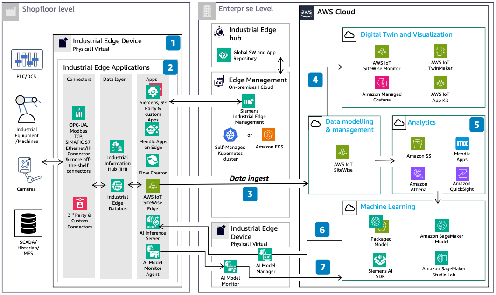

# Siemens Industrial Edge on AWS

Publication date: **May 13, 2024 ([Diagram history](#sie-diagram-history "#sie-diagram-history"))**

With this architecture, you can integrate [AWS IoT SiteWise](../../../iot-sitewise/latest/userguide.md "../../../iot-sitewise/latest/userguide.md") Edge on Siemens Industrial
Edge for decentralized data acquisition, storage, analytics, AI, and connectivity to AWS.
Siemens Industrial Edge is an open software platform for shop-floor IT.
This architecture uses AWS IoT SiteWise, [Amazon Simple Storage Service](../../../AmazonS3/latest/userguide.md "../../../AmazonS3/latest/userguide.md"), [Amazon Athena](../../../athena/latest/ug.md "../../../athena/latest/ug.md"), and Amazon Managed Grafana.

## Siemens Industrial Edge architecture diagram

The following steps describe the architecture:

1. Siemens Industrial Edge is an open software platform for shop-floor
   IT. Industrial Edge Management allows remote and central management of edge devices and
   applications.
2. Southbound connector applications on Industrial Edge Devices collect data from
   industrial assets. You create apps through Mendix on Edge,
   Flow Creator, or Docker.
3. AWS IoT SiteWise Edge on Industrial Edge devices collects and aggregates data. It then sends
   this data to AWS IoT SiteWise in the AWS Cloud.
4. Use AWS IoT SiteWise Monitor, AWS IoT TwinMaker, or [Amazon Managed Grafana](../../../grafana/latest/userguide.md "../../../grafana/latest/userguide.md") to visualize collected industrial
   data.
5. Use [Athena](../../../athena/latest/ug.md "../../../athena/latest/ug.md") to query cold
   IoT data from [Amazon S3](../../../AmazonS3/latest/userguide.md "../../../AmazonS3/latest/userguide.md")
   for analytics with Grafana, [Quick](../../../quicksight/latest/user/welcome.md "../../../quicksight/latest/user/welcome.md"), or Mendix
   apps.
6. Use AWS AI and ML services with data from Amazon S3 to train ML models. Combine with
   the Siemens AI SDK to package and deploy models back to the
   edge.
7. Siemens AI Model Manager deploys and manages ML models on the edge.
   AI Inference Server runs models. AI Model Monitor monitors them.

## Further reading

For additional information, see the following resources:

- [AWS Architecture Icons](https://aws.amazon.com/architecture/icons "https://aws.amazon.com/architecture/icons")
- [AWS Architecture Center](https://aws.amazon.com/architecture "https://aws.amazon.com/architecture")
- [AWS Well-Architected](https://aws.amazon.com/architecture/well-architected "https://aws.amazon.com/architecture/well-architected")
- [Siemens Teamcenter Product Lifecycle Management on AWS](../siemens-teamcenter-plm/siemens-teamcenter-plm.md "../siemens-teamcenter-plm/siemens-teamcenter-plm.md")

## Diagram history

To be notified about updates to this reference architecture diagram, subscribe to the RSS feed.

| Change              | Description                                     | Date         |
| ------------------- | ----------------------------------------------- | ------------ |
| Initial publication | Reference architecture diagram first published. | May 13, 2024 |

###### RSS subscription

To subscribe to RSS updates, you must have an RSS plugin enabled for the browser that you are using.
