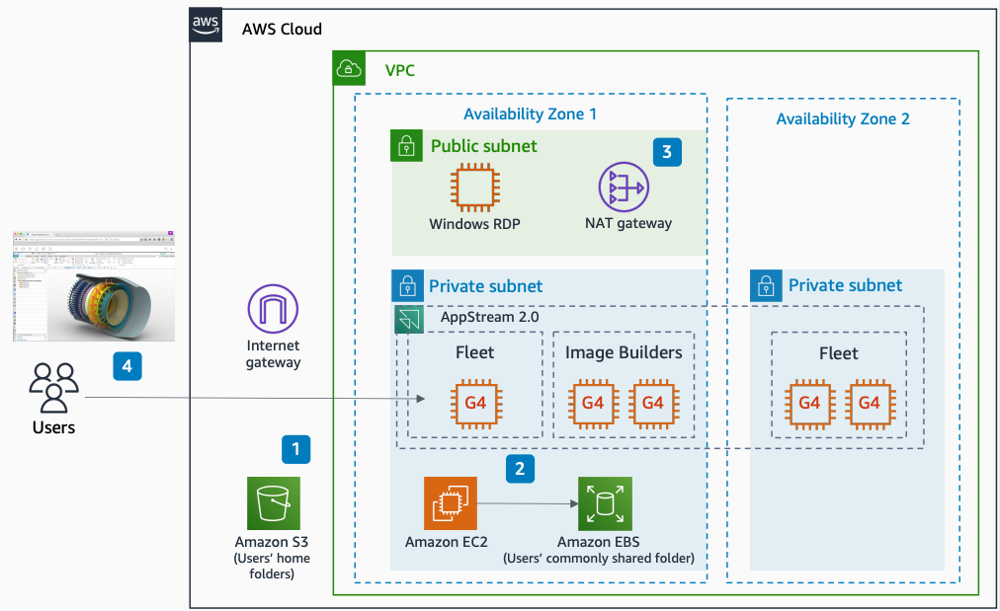

# Siemens NX with Amazon EBS shared folders

With this architecture, you can securely access Siemens NX hosted in
AWS Cloud by using an [Amazon Elastic Block Store](../../../ebs/latest/userguide.md "../../../ebs/latest/userguide.md") (Amazon EBS) volume for shared folders. This
architecture uses [Amazon WorkSpaces Applications](../../../appstream2/latest/developerguide.md "../../../appstream2/latest/developerguide.md"), [Amazon Elastic Compute Cloud](../../../AWSEC2/latest/UserGuide.md "../../../AWSEC2/latest/UserGuide.md") (Amazon EC2), and [Amazon S3](../../../AmazonS3/latest/userguide.md "../../../AmazonS3/latest/userguide.md").

The following steps describe the architecture:

1. When setting up the WorkSpaces Applications image builder, you can select the Amazon S3 folder as the user
   home folder to persist application settings, user data, and files.
2. An Amazon EC2 instance hosts the Amazon EBS volume. The instance acts as a server message block
   (SMB) share to serve its Amazon EBS volume as a shared folder for all WorkSpaces Applications users.
3. The Windows Remote Desktop Protocol (RDP) instance acts as a jump server to connect
   to the Amazon EC2 instance on a private subnet.
4. Users connect to their streaming instances through a web browser or the WorkSpaces Applications
   Windows client.
