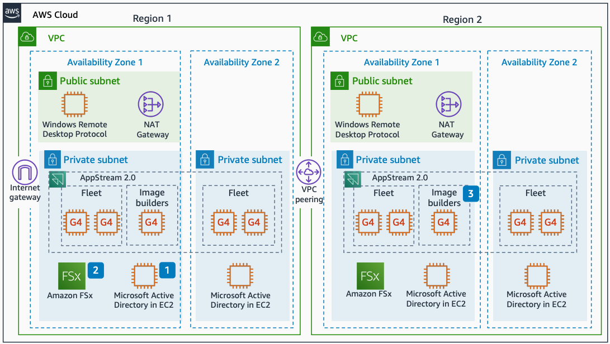

# Siemens NX multi-Region deployment

With this architecture, you can minimize latency by cross-replicating storage across
Regions. This deployment uses [Amazon WorkSpaces Applications](../../../appstream2/latest/developerguide.md "../../../appstream2/latest/developerguide.md"), [Amazon Elastic Compute Cloud](../../../AWSEC2/latest/UserGuide.md "../../../AWSEC2/latest/UserGuide.md") (Amazon EC2), and [Amazon FSx](../../../fsx/latest/WindowsGuide.md "../../../fsx/latest/WindowsGuide.md").

The following steps describe the architecture:

1. Two pairs of Microsoft Active Directory instances on Amazon EC2 run in each Region.
   Each instance runs in a different Availability Zone. Active Directory instances fully
   replicate across Availability Zones and Regions through Active Directory sites.
2. Two Amazon FSx single-Availability-Zone file systems are created in each Region. Full
   bidirectional Amazon FSx data replication uses Microsoft Distributed File System
   Replication.
3. Amazon WorkSpaces Applications image builders are shared across multiple Regions. An administrator
   tunes each image to access its closest Microsoft Active Directory and Amazon FSx
   instances.
