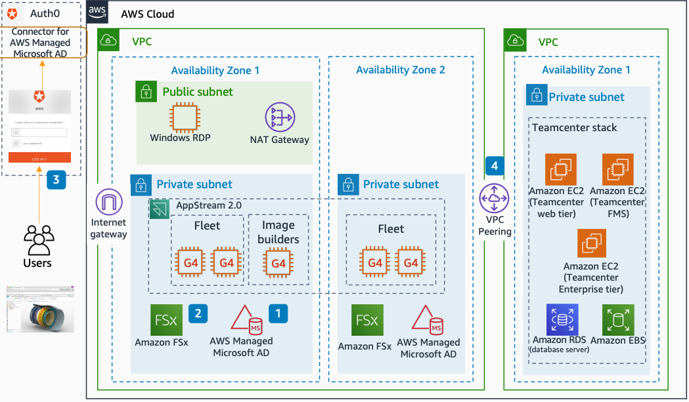

# Siemens NX connected to Siemens Teamcenter

With this architecture, you can use [Amazon FSx](../../../fsx/latest/WindowsGuide.md "../../../fsx/latest/WindowsGuide.md") as a storage option for
Siemens NX streamed through [Amazon WorkSpaces Applications](../../../appstream2/latest/developerguide.md "../../../appstream2/latest/developerguide.md"). This architecture uses [AWS Directory Service](../../../directoryservice/latest/admin-guide.md "../../../directoryservice/latest/admin-guide.md") for
Microsoft Active Directory and connects to Siemens Teamcenter.

The following steps describe the architecture:

1. Directory Service for Microsoft Active Directory manages users, computers, and storage as
   Amazon FSx. Amazon WorkSpaces Applications can then join the domain as configured in Active Directory.
   Authorized users in Active Directory can access WorkSpaces Applications sessions.
2. Amazon FSx replicates across multiple Availability Zones and is accessible in an WorkSpaces Applications
   session. You can configure user folders and shared folders in Amazon FSx by using Active
   Directory Group Policy access.
3. Single sign-in is established through federation of Active Directory SAML 2.0 with
   Auth0.
4. Siemens NX streams through WorkSpaces Applications and communicates through the
   Amazon VPC peer to Siemens Teamcenter running on another VPC.
