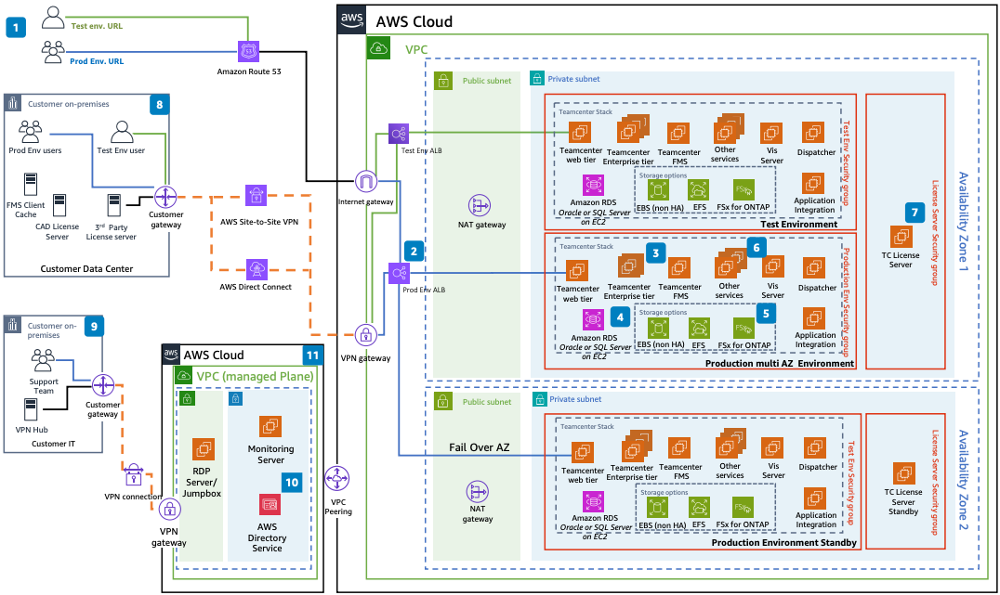

# Siemens Teamcenter Product Lifecycle Management on AWS

Publication date: **March 8, 2024 ([Diagram history](#stp-diagram-history "#stp-diagram-history"))**

With this architecture, you can deploy Siemens Teamcenter on AWS for
high availability with Siemens Active Workspace and visualization. This
solution uses [Amazon Elastic Compute Cloud](../../../AWSEC2/latest/UserGuide.md "../../../AWSEC2/latest/UserGuide.md"), [Amazon Relational Database Service](../../../AmazonRDS/latest/UserGuide.md "../../../AmazonRDS/latest/UserGuide.md"), [Amazon Elastic File System](../../../efs/latest/ug.md "../../../efs/latest/ug.md"), [Amazon Elastic Block Store](../../../AWSEC2/latest/UserGuide.md "../../../AWSEC2/latest/UserGuide.md"), [AWS Direct Connect](../../../directconnect/latest/UserGuide.md "../../../directconnect/latest/UserGuide.md"), and [Amazon Route 53](../../../Route53/latest/DeveloperGuide.md "../../../Route53/latest/DeveloperGuide.md").

## Siemens Teamcenter PLM architecture diagram

The following steps describe the architecture:

1. End users connect to Teamcenter through HTTPS over the
   internet.
2. Application Load Balancer directs traffic to the Teamcenter Web tier
   on Amazon EC2.
3. Requests forward to the Teamcenter Enterprise Tier, which interacts
   with other servers and databases.
4. Teamcenter uses Amazon RDS for Oracle or Microsoft SQL Server on Amazon EC2
   for structured product lifecycle management (PLM) data.
5. Teamcenter File Management System stores and retrieves files from
   Amazon EBS, Amazon EFS, or Amazon FSx for NetApp ONTAP.
6. Additional services include Active Workspace, Apache
   Solr, and Deployment Center.
7. Siemens license server instances deploy across three Availability
   Zones for high availability.
8. Data center users access environments through Direct Connect, VPN, or HTTPS.
9. IT teams connect through VPN for RDP, [Amazon WorkSpaces Applications](../../../appstream2/latest/developerguide.md "../../../appstream2/latest/developerguide.md"), or AWS Systems Manager
   access.
10. [AWS Directory Service](../../../directoryservice/latest/admin-guide.md "../../../directoryservice/latest/admin-guide.md") on AWS or on premises
    provides admin authentication.
11. A monitoring server on Amazon EC2 monitors systems, networks, and
    infrastructure.

## Further reading

For additional information, see the following resources:

- [AWS Architecture Icons](https://aws.amazon.com/architecture/icons "https://aws.amazon.com/architecture/icons")
- [AWS Architecture Center](https://aws.amazon.com/architecture "https://aws.amazon.com/architecture")
- [AWS Well-Architected](https://aws.amazon.com/architecture/well-architected "https://aws.amazon.com/architecture/well-architected")

## Diagram history

To be notified about updates to this reference architecture diagram, subscribe to the RSS feed.

| Change              | Description                                     | Date          |
| ------------------- | ----------------------------------------------- | ------------- |
| Initial publication | Reference architecture diagram first published. | March 8, 2024 |

###### RSS subscription

To subscribe to RSS updates, you must have an RSS plugin enabled for the browser that you are using.
