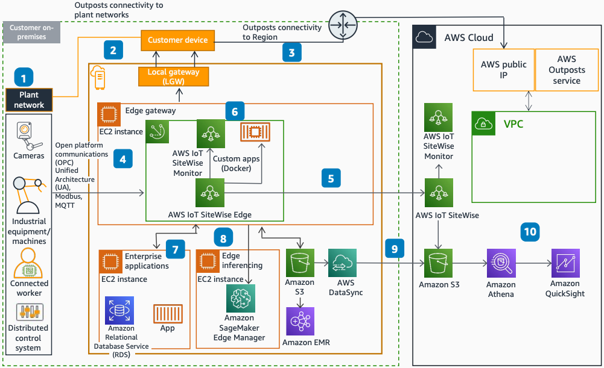

# Smart Factory on AWS Outposts

Publication date: **March 16, 2022 ([Diagram history](#sfo-diagram-history "#sfo-diagram-history"))**

With this architecture, you can build a scalable, secure IoT-backed smart factory by
using [AWS Outposts](../../../outposts/latest/userguide.md "../../../outposts/latest/userguide.md") and AWS Regions. This architecture
uses [AWS IoT Greengrass](../../../greengrass/v2/developerguide.md "../../../greengrass/v2/developerguide.md"),
[AWS IoT SiteWise](../../../iot-sitewise/latest/userguide.md "../../../iot-sitewise/latest/userguide.md"), [Amazon Elastic Compute Cloud](../../../AWSEC2/latest/UserGuide.md "../../../AWSEC2/latest/UserGuide.md") (Amazon EC2), and [Amazon SageMaker AI](../../../sagemaker/latest/dg.md "../../../sagemaker/latest/dg.md").

## Smart factory architecture diagram

The following steps describe the architecture:

1. The Outpost is located on the factory premises and connected to the factory
   network through the local gateway (LGW).
2. The Outpost also connects back to the AWS Region, so you can use AWS services
   in the Region.
3. The plant network connects devices like cameras, equipment, and programmable logic
   controller (PLC) systems to run plant operations.
4. An Amazon EC2 instance on Outposts acts as an edge gateway. It runs AWS IoT Greengrass and AWS IoT SiteWise
   Edge to connect with the plant network.
5. The AWS IoT SiteWise Edge component ingests real-time equipment data to the Cloud. It also
   buffers the data during disconnections.
6. Deploy local dashboards and custom applications on AWS IoT Greengrass for time-critical
   monitoring and processing.
7. Enterprise apps and point solutions deployed on Outposts as containers can consume
   data locally from AWS IoT Greengrass.
8. SageMaker AI Neo-optimized models deploy on Outposts for edge inferencing.
9. [AWS DataSync](../../../datasync/latest/userguide.md "../../../datasync/latest/userguide.md")
   automates transfer of data between [Amazon S3](../../../AmazonS3/latest/userguide.md "../../../AmazonS3/latest/userguide.md") on Outposts and in the AWS
   Region.
10. Use Amazon Athena and Quick in the Region for running weekly analytics on the
    data.

## Further reading

For additional information, see the following resources:

- [AWS Architecture Icons](https://aws.amazon.com/architecture/icons "https://aws.amazon.com/architecture/icons")
- [AWS Architecture Center](https://aws.amazon.com/architecture "https://aws.amazon.com/architecture")
- [AWS Well-Architected](https://aws.amazon.com/architecture/well-architected "https://aws.amazon.com/architecture/well-architected")

## Diagram history

To be notified about updates to this reference architecture diagram, subscribe to the RSS feed.

| Change              | Description                                     | Date           |
| ------------------- | ----------------------------------------------- | -------------- |
| Initial publication | Reference architecture diagram first published. | March 16, 2022 |

###### RSS subscription

To subscribe to RSS updates, you must have an RSS plugin enabled for the browser that you are using.
