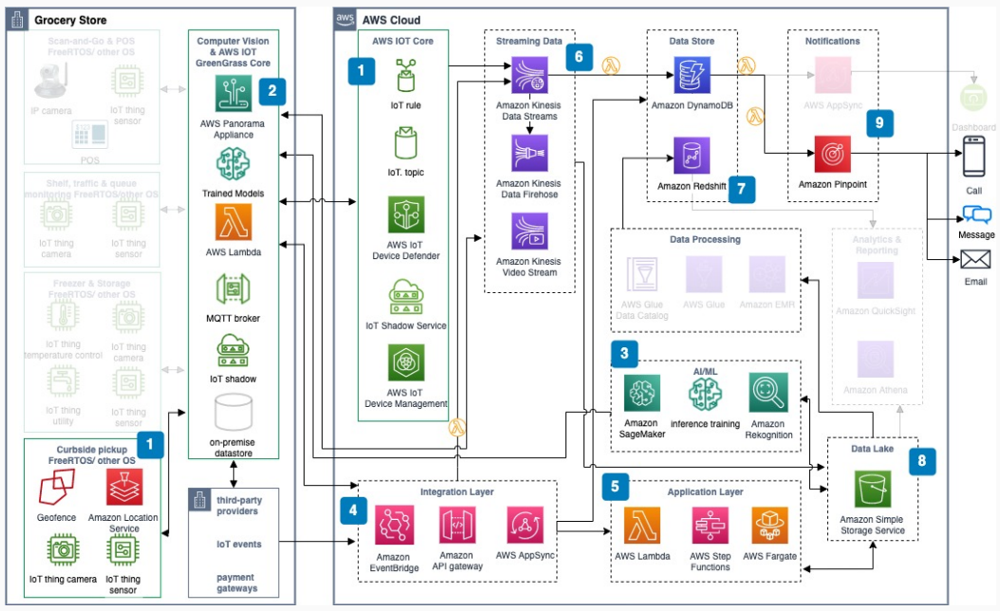

# Curbside pickup use case

With this use case, you can automate curbside pickup by using geofencing, computer vision,
and serverless order management on AWS.

## Architecture diagram

The following steps describe the architecture:

1. [Amazon Location Service](../../../location/latest/developerguide.md "../../../location/latest/developerguide.md") provides geofencing and
   notifies an in-store associate when a customer enters the parking lot. Cameras and
   sensors monitor vehicle movement and read the tag number.
2. An application and pre-trained ML model on the [AWS Panorama](../../../panorama/latest/dev.md "../../../panorama/latest/dev.md") appliance processes camera video and
   notifies the in-store team for curbside delivery.
3. Processed videos go to [Amazon SageMaker Ground Truth](../../../sagemaker/latest/dg.md "../../../sagemaker/latest/dg.md") and Amazon SageMaker AI inference training.
4. [Amazon API Gateway](../../../apigateway/latest/developerguide.md "../../../apigateway/latest/developerguide.md"), [Amazon EventBridge](../../../eventbridge/latest/userguide.md "../../../eventbridge/latest/userguide.md"), and AWS AppSync form the integration
   layer between ordering and fulfillment applications.
5. The core application layer uses [AWS Lambda](../../../lambda/latest/dg.md "../../../lambda/latest/dg.md") and [AWS Step Functions](../../../step-functions/latest/dg.md "../../../step-functions/latest/dg.md") to orchestrate order
   management.
6. [Amazon Kinesis Data Streams](../../../kinesis/latest/dev.md "../../../kinesis/latest/dev.md") ingests sensor data into [Amazon S3](../../../AmazonS3/latest/userguide.md "../../../AmazonS3/latest/userguide.md"). Amazon Kinesis Video Streams
   streams camera feeds.
7. [Amazon DynamoDB](../../../amazondynamodb/latest/developerguide.md "../../../amazondynamodb/latest/developerguide.md") stores events from
   sensors and cameras with notifications for the in-store team.
8. Build an Amazon S3 data lake for raw and curated data (images, video, customer
   details).
9. Build a real-time operational dashboard by using AWS AppSync. Deliver alerts across
   channels with [Amazon Pinpoint](../../../pinpoint/latest/userguide.md "../../../pinpoint/latest/userguide.md").

## Further reading

For additional information, see the following resources:

- [AWS Architecture Icons](https://aws.amazon.com/architecture/icons "https://aws.amazon.com/architecture/icons")
- [AWS Architecture Center](https://aws.amazon.com/architecture/ "https://aws.amazon.com/architecture/")
- [AWS Well-Architected](https://aws.amazon.com/architecture/well-architected "https://aws.amazon.com/architecture/well-architected")

## Diagram history

To receive updates about this reference architecture diagram, subscribe to the RSS
feed.

| Change                                                                                                                             | Description                                     | Date         |
| ---------------------------------------------------------------------------------------------------------------------------------- | ----------------------------------------------- | ------------ |
| [Initial publication](smart-grocery-scan-and-go.md#sg-history "smart-grocery-scan-and-go.md#sg-history")                           | Reference architecture diagram first published. | May 18, 2022 |
| [Initial publication](smart-grocery-scan-and-go-use-case.md#sg-uc1-history "smart-grocery-scan-and-go-use-case.md#sg-uc1-history") | Reference architecture diagram first published. | May 18, 2022 |
| Initial publication                                                                                                                | Reference architecture diagram first published. | May 18, 2022 |
| [Initial publication](smart-grocery-in-store-monitoring.md#sg-uc3-history "smart-grocery-in-store-monitoring.md#sg-uc3-history")   | Reference architecture diagram first published. | May 18, 2022 |

###### RSS subscription requirement

To subscribe to RSS updates, you must have an RSS plugin enabled for the browser you
are using.
