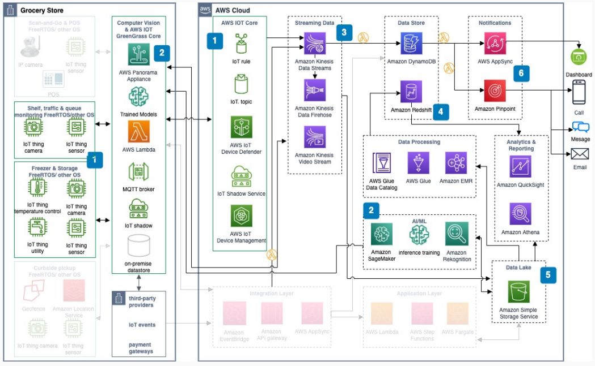

# In-store monitoring use case

With this use case, you can build an in-store monitoring solution by using IoT sensors,
computer vision, and AWS analytics services for real-time operations visibility.

## Architecture diagram

The following steps describe the architecture:

1. Use [AWS IoT Greengrass](../../../greengrass/v2/developerguide.md "../../../greengrass/v2/developerguide.md") core to manage connections and
   aggregate data from in-store sensors and devices by using Message Queuing Telemetry Transport (MQTT). Use
   [AWS IoT Core](../../../iot/latest/developerguide.md "../../../iot/latest/developerguide.md") to
   manage all in-store smart devices.
2. Use the [AWS Panorama](../../../panorama/latest/dev.md "../../../panorama/latest/dev.md") on-premises appliance to apply AI/ML models
   to data from in-store IP cameras. Use [Amazon SageMaker Ground Truth](../../../sagemaker/latest/dg.md "../../../sagemaker/latest/dg.md") and Amazon SageMaker AI inference training to build
   and maintain computer vision models.
3. [Amazon Kinesis Data Streams](../../../kinesis/latest/dev.md "../../../kinesis/latest/dev.md") and Amazon Kinesis Data Firehose stream
   in-store device and IoT data into [Amazon S3](../../../AmazonS3/latest/userguide.md "../../../AmazonS3/latest/userguide.md"). Amazon Kinesis Video Streams optimizes IP camera feeds
   into AWS Panorama.
4. [Amazon DynamoDB](../../../amazondynamodb/latest/developerguide.md "../../../amazondynamodb/latest/developerguide.md") stores events, connects
   to smart grocery services, and generates notifications. [Amazon Redshift](../../../redshift/latest/dg.md "../../../redshift/latest/dg.md") is the core data warehouse.
5. Use a scalable Amazon S3 data lake to store all in-store and digital data by using [AWS Glue](../../../glue/latest/dg.md "../../../glue/latest/dg.md") and [Amazon EMR](../../../emr/latest/ManagementGuide.md "../../../emr/latest/ManagementGuide.md"). Use [Amazon Athena](../../../athena/latest/ug.md "../../../athena/latest/ug.md") for reporting and
   analytics.
6. Build a real-time operations dashboard by using AWS AppSync. Use [Amazon Pinpoint](../../../pinpoint/latest/userguide.md "../../../pinpoint/latest/userguide.md") for targeted,
   location-based messaging.

## Further reading

For additional information, see the following resources:

- [AWS Architecture Icons](https://aws.amazon.com/architecture/icons "https://aws.amazon.com/architecture/icons")
- [AWS Architecture Center](https://aws.amazon.com/architecture/ "https://aws.amazon.com/architecture/")
- [AWS Well-Architected](https://aws.amazon.com/architecture/well-architected "https://aws.amazon.com/architecture/well-architected")

## Diagram history

To receive updates about this reference architecture diagram, subscribe to the RSS
feed.

| Change                                                                                                                             | Description                                     | Date         |
| ---------------------------------------------------------------------------------------------------------------------------------- | ----------------------------------------------- | ------------ |
| [Initial publication](smart-grocery-scan-and-go.md#sg-history "smart-grocery-scan-and-go.md#sg-history")                           | Reference architecture diagram first published. | May 18, 2022 |
| [Initial publication](smart-grocery-scan-and-go-use-case.md#sg-uc1-history "smart-grocery-scan-and-go-use-case.md#sg-uc1-history") | Reference architecture diagram first published. | May 18, 2022 |
| [Initial publication](smart-grocery-curbside-pickup.md#sg-uc2-history "smart-grocery-curbside-pickup.md#sg-uc2-history")           | Reference architecture diagram first published. | May 18, 2022 |
| Initial publication                                                                                                                | Reference architecture diagram first published. | May 18, 2022 |

###### RSS subscription requirement

To subscribe to RSS updates, you must have an RSS plugin enabled for the browser you
are using.
