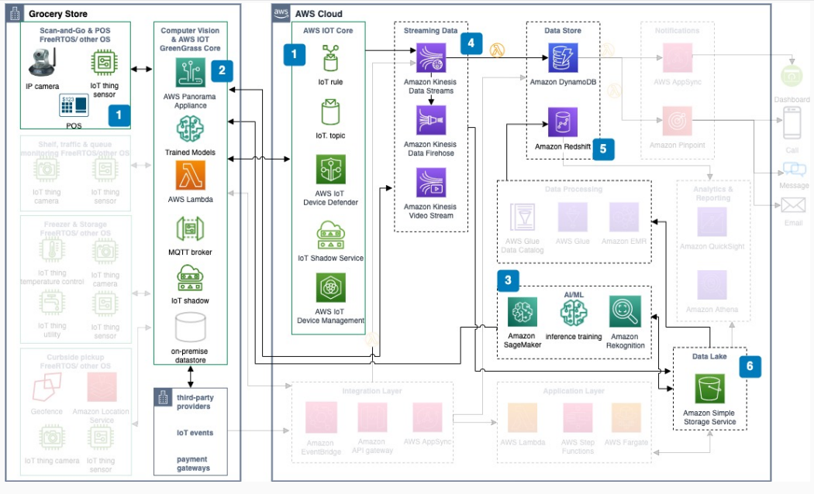

# Scan-and-Go use case

With this use case, you can build a Scan-and-Go checkout experience by using in-store IP
cameras, sensors, and POS integration with AWS computer vision and streaming services.

## Architecture diagram

The following steps describe the architecture:

1. In-store IP cameras capture real-time video of the checkout process. With sensors
   and POS, they identify products and make checkout seamless.
2. [AWS Panorama](../../../panorama/latest/dev.md "../../../panorama/latest/dev.md") processes the
   video on-premises by using optimized AI/ML models. Results integrate into customer
   ordering and associate fulfillment applications.
3. Processed videos go to [Amazon SageMaker Ground Truth](../../../sagemaker/latest/dg.md "../../../sagemaker/latest/dg.md") and Amazon SageMaker AI inference training to
   optimize computer vision models.
4. [Amazon Kinesis Data Streams](../../../kinesis/latest/dev.md "../../../kinesis/latest/dev.md") ingests in-store sensor and device data.
   Amazon Kinesis Data Firehose loads it into an [Amazon S3](../../../AmazonS3/latest/userguide.md "../../../AmazonS3/latest/userguide.md") data lake. Amazon Kinesis Video Streams optimizes IP
   camera feeds.
5. [Amazon DynamoDB](../../../amazondynamodb/latest/developerguide.md "../../../amazondynamodb/latest/developerguide.md") stores sensor telemetry
   from smart devices with trigger-based notifications. [Amazon Redshift](../../../redshift/latest/dg.md "../../../redshift/latest/dg.md") is the core data warehouse for
   analytics.
6. Use a scalable Amazon S3 data lake to store raw device data and curated processed data
   such as images, shopper analytics, and commerce details.

## Further reading

For additional information, see the following resources:

- [AWS Architecture Icons](https://aws.amazon.com/architecture/icons "https://aws.amazon.com/architecture/icons")
- [AWS Architecture Center](https://aws.amazon.com/architecture/ "https://aws.amazon.com/architecture/")
- [AWS Well-Architected](https://aws.amazon.com/architecture/well-architected "https://aws.amazon.com/architecture/well-architected")

## Diagram history

To receive updates about this reference architecture diagram, subscribe to the RSS
feed.

| Change                                                                                                                           | Description                                     | Date         |
| -------------------------------------------------------------------------------------------------------------------------------- | ----------------------------------------------- | ------------ |
| [Initial publication](smart-grocery-scan-and-go.md#sg-history "smart-grocery-scan-and-go.md#sg-history")                         | Reference architecture diagram first published. | May 18, 2022 |
| Initial publication                                                                                                              | Reference architecture diagram first published. | May 18, 2022 |
| [Initial publication](smart-grocery-curbside-pickup.md#sg-uc2-history "smart-grocery-curbside-pickup.md#sg-uc2-history")         | Reference architecture diagram first published. | May 18, 2022 |
| [Initial publication](smart-grocery-in-store-monitoring.md#sg-uc3-history "smart-grocery-in-store-monitoring.md#sg-uc3-history") | Reference architecture diagram first published. | May 18, 2022 |

###### RSS subscription requirement

To subscribe to RSS updates, you must have an RSS plugin enabled for the browser you
are using.
