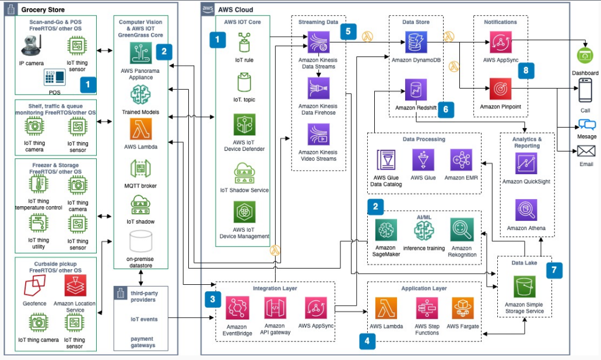

# Smart Grocery with Scan-and-Go, Computer Vision, and IoT

Publication date: **May 18, 2022 ([Diagram history](#sg-history "#sg-history"))**

With this architecture, you can build a smart grocery with Scan-and-Go shopping,
traditional point-of-sale (POS), self-checkout, Internet of Things (IoT) connectivity around
freezers and storage, and computer vision by using AWS Panorama for shelf-stock intelligence, traffic
patterns, queue analysis, and curbside fulfillment automation.

## Architecture diagram

The following steps describe the architecture:

1. Use [AWS IoT Greengrass](../../../greengrass/v2/developerguide.md "../../../greengrass/v2/developerguide.md") core to manage connections and
   aggregate data from in-store sensors and smart retail devices by using the open-standard
   Message Queuing Telemetry Transport (MQTT) protocol.
2. Use the [AWS Panorama](../../../panorama/latest/dev.md "../../../panorama/latest/dev.md") on-premises appliance to apply ML and AI
   models to data from existing in-store IP cameras for smart grocery picking and
   fulfillment workflows.
3. [Amazon API Gateway](../../../apigateway/latest/developerguide.md "../../../apigateway/latest/developerguide.md"), [Amazon EventBridge](../../../eventbridge/latest/userguide.md "../../../eventbridge/latest/userguide.md"), and AWS AppSync form an integration
   layer between customer-facing digital ordering applications, associate-facing
   order-picking applications, and their business logic and data sources.
4. The core smart grocery application layer uses serverless services like [AWS Lambda](../../../lambda/latest/dg.md "../../../lambda/latest/dg.md") and [AWS Step Functions](../../../step-functions/latest/dg.md "../../../step-functions/latest/dg.md") to orchestrate
   order management workflows and connect to transaction, customer, and inventory
   data.
5. [Amazon Kinesis Data Streams](../../../kinesis/latest/dev.md "../../../kinesis/latest/dev.md") and Amazon Kinesis Data Firehose stream
   in-store smart device and IoT data. Amazon Kinesis Video Streams optimizes IP camera video feeds for
   computer vision.
6. [Amazon DynamoDB](../../../amazondynamodb/latest/developerguide.md "../../../amazondynamodb/latest/developerguide.md") stores events, connects
   to smart grocery services, and generates notifications for transactional data.
7. A scalable data lake stores all in-store and digital data (transactional, sensor,
   telemetry) in [Amazon Simple Storage Service (Amazon S3)](../../../AmazonS3/latest/userguide.md "../../../AmazonS3/latest/userguide.md").
8. Build a real-time operations dashboard by using AWS AppSync. Use [Amazon Pinpoint](../../../pinpoint/latest/userguide.md "../../../pinpoint/latest/userguide.md") to deliver
   targeted, location-based messaging across channels.

## Further reading

For additional information, see the following resources:

- [AWS Architecture Icons](https://aws.amazon.com/architecture/icons "https://aws.amazon.com/architecture/icons")
- [AWS Architecture Center](https://aws.amazon.com/architecture/ "https://aws.amazon.com/architecture/")
- [AWS Well-Architected](https://aws.amazon.com/architecture/well-architected "https://aws.amazon.com/architecture/well-architected")

## Diagram history

To receive updates about this reference architecture diagram, subscribe to the RSS
feed.

| Change                                                                                                                             | Description                                     | Date         |
| ---------------------------------------------------------------------------------------------------------------------------------- | ----------------------------------------------- | ------------ |
| Initial publication                                                                                                                | Reference architecture diagram first published. | May 18, 2022 |
| [Initial publication](smart-grocery-scan-and-go-use-case.md#sg-uc1-history "smart-grocery-scan-and-go-use-case.md#sg-uc1-history") | Reference architecture diagram first published. | May 18, 2022 |
| [Initial publication](smart-grocery-curbside-pickup.md#sg-uc2-history "smart-grocery-curbside-pickup.md#sg-uc2-history")           | Reference architecture diagram first published. | May 18, 2022 |
| [Initial publication](smart-grocery-in-store-monitoring.md#sg-uc3-history "smart-grocery-in-store-monitoring.md#sg-uc3-history")   | Reference architecture diagram first published. | May 18, 2022 |

###### RSS subscription requirement

To subscribe to RSS updates, you must have an RSS plugin enabled for the browser you
are using.
