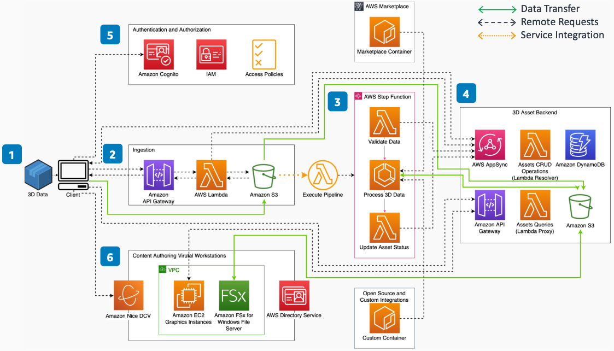

# Spatial Computing 3D Content Management

Publication date: **August 27, 2021 ([Diagram history](#sc3d-history "#sc3d-history"))**

With this architecture, you can create a single source of truth for 3D assets. Automate
ingestion, transformation, and versioning of 3D assets. Process computer-aided design (CAD),
photogrammetry, light detection and ranging (LiDAR), or other existing 3D data. The solution
uses [Amazon Simple Storage Service](../../../AmazonS3/latest/userguide.md "../../../AmazonS3/latest/userguide.md") (Amazon S3), [Amazon DynamoDB](../../../amazondynamodb/latest/developerguide.md "../../../amazondynamodb/latest/developerguide.md"), [AWS Lambda](../../../lambda/latest/dg.md "../../../lambda/latest/dg.md"), and [AWS Step Functions](../../../step-functions/latest/dg.md "../../../step-functions/latest/dg.md").

## Spatial computing 3D content management diagram

The following steps describe the architecture:

1. With a graphical user interface (GUI) or command-line interface (CLI) client, users
   upload 3D data, make queries against existing data, and connect to virtual
   workstations.
2. On initial upload, the system creates an asset entry in a DynamoDB table. Uploading
   source data to Amazon S3 triggers an event that invokes a Lambda function to initiate a Step Functions
   workflow.
3. The workflow has three states: inspect the validity of uploaded source data, process
   the data with AWS Marketplace or open source tools, and record the results in the asset
   database.
4. Use [AWS AppSync](../../../appsync/latest/devguide.md "../../../appsync/latest/devguide.md") to manage create, read, write, and
   delete operations to asset entries with GraphQL mutations. Consuming applications
   subscribe to GraphQL subscriptions for real-time updates. Implement a REST API with
   [Amazon API Gateway](../../../apigateway/latest/developerguide.md "../../../apigateway/latest/developerguide.md") for request and response
   communication.
5. [Amazon Cognito](../../../cognito/latest/developerguide.md "../../../cognito/latest/developerguide.md") handles authentication. [AWS Identity and Access Management](../../../IAM/latest/UserGuide.md "../../../IAM/latest/UserGuide.md") user group policies
   control fine-grained access over asset resources.
6. Virtual workstation desktops stream over the network with [Amazon EC2](../../../AWSEC2/latest/UserGuide.md "../../../AWSEC2/latest/UserGuide.md") graphics instances backed by [Amazon DCV](../../../dcv/latest/adminguide.md "../../../dcv/latest/adminguide.md") for manual content
   authoring.

## Further reading

For additional information, see the following resources:

- [AWS Architecture Icons](https://aws.amazon.com/architecture/icons "https://aws.amazon.com/architecture/icons")
- [AWS Architecture Center](https://aws.amazon.com/architecture/ "https://aws.amazon.com/architecture/")
- [AWS
  Well-Architected](https://aws.amazon.com/architecture/well-architected "https://aws.amazon.com/architecture/well-architected")

## Diagram history

To receive updates about this reference architecture diagram, subscribe to the RSS
feed.

| Change              | Description                                     | Date            |
| ------------------- | ----------------------------------------------- | --------------- |
| Initial publication | Reference architecture diagram first published. | August 27, 2021 |

###### RSS subscription requirement

To subscribe to RSS updates, you must have an RSS plugin enabled for the browser you are
using.
