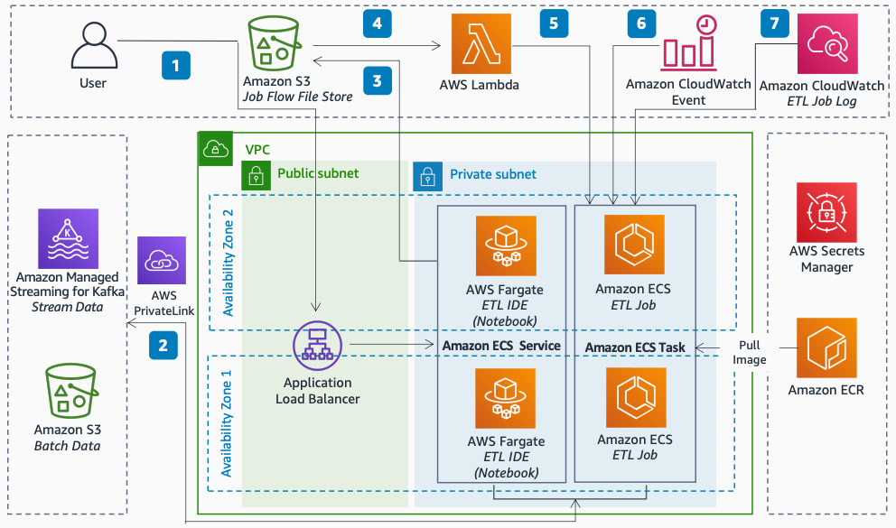

# SQL Based Data Processing in Amazon ECS

Publication date: **March 8, 2021 ([Diagram history](#diagram-history "#diagram-history"))**

This architecture shows how to build a configuration-driven, codeless extract-transform-load (ETL) alternative using a containerized ETL framework ([ARC](https://arc.tripl.ai/ "https://arc.tripl.ai/")) that simplifies and accelerates data processing with Apache Spark. You run the framework on [Amazon Elastic Container Service](../../../AmazonECS/latest/developerguide/Welcome.md "../../../AmazonECS/latest/developerguide/Welcome.md") with [AWS Fargate](../../../AmazonECS/latest/developerguide/AWS_Fargate.md "../../../AmazonECS/latest/developerguide/AWS_Fargate.md").

## SQL Based Data Processing in Amazon ECS

The following steps describe the architecture:

1. A user creates an ETL data pipeline based on the ARC framework and SQL scripts in an interactive ARC Jupyter Notebook. The notebook runs on Amazon ECS with AWS Fargate.
2. The notebook and ETL jobs process batch and stream data through AWS PrivateLink. Traffic between ETL processes and data stores does not leave the Amazon network.
3. The ARC Jupyter notebook produces a job flow configuration JSON file. The user uploads the file and SQL scripts to [Amazon Simple Storage Service](../../../AmazonS3/latest/userguide/Welcome.md "../../../AmazonS3/latest/userguide/Welcome.md") through a CI/CD automated deployment process or manually.
4. An Amazon S3 file arrival event triggers an [AWS Lambda](../../../lambda/latest/dg/welcome.md "../../../lambda/latest/dg/welcome.md") function.
5. The Lambda function spins up an Amazon ECS task to process batch data in a transient way, or to process stream data continuously in a long-running container. Each job uses isolated compute resources.
6. [Amazon CloudWatch](../../../AmazonCloudWatch/latest/monitoring/WhatIsCloudWatch.md "../../../AmazonCloudWatch/latest/monitoring/WhatIsCloudWatch.md") Events schedules and orchestrates regular ARC ETL jobs and Amazon ECS tasks with AWS Fargate or Amazon EC2 launch types.
7. ARC ETL jobs generate application logs for each data processing stage at a granular level. CloudWatch provides monitoring and alerting capabilities.

## Further reading

For additional information, refer to the following resources:

- [AWS Architecture Icons](https://aws.amazon.com/architecture/icons "https://aws.amazon.com/architecture/icons")
- [AWS Architecture Center](https://aws.amazon.com/architecture "https://aws.amazon.com/architecture")
- [AWS Well-Architected](https://aws.amazon.com/architecture/well-architected "https://aws.amazon.com/architecture/well-architected")

## Diagram history

To be notified about updates to this reference architecture diagram, subscribe to the RSS feed.

| Change              | Description                                     | Date          |
| ------------------- | ----------------------------------------------- | ------------- |
| Initial publication | Reference architecture diagram first published. | March 8, 2021 |

###### Note

To subscribe to RSS updates, you must have an RSS plugin enabled for the browser you are using.
