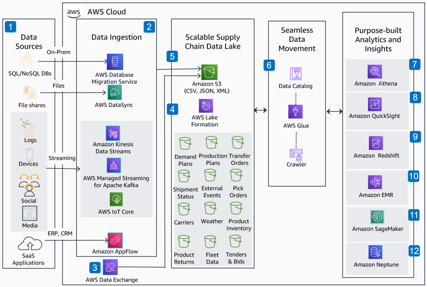

# Supply Chain Data Lake Solution

Publication date: **May 18, 2022 ([Diagram history](#scdl-history "#scdl-history"))**

With this architecture, you can build a supply chain data lake on AWS. Ingest data from
planning, execution, and real-time shipment status providers. Build cross-category scorecards
for analysts and planners. The solution uses [AWS Lake Formation](../../../lake-formation/latest/dg.md "../../../lake-formation/latest/dg.md") for the data lake and [AWS Glue](../../../glue/latest/dg.md "../../../glue/latest/dg.md") for extract, transform, and load
(ETL). [Amazon SageMaker AI](../../../sagemaker/latest/dg.md "../../../sagemaker/latest/dg.md") provides
machine learning (ML) capabilities.

## Supply chain data lake diagram

The following steps describe the data ingestion and analytics pipeline for this
architecture:

1. Collect supply chain data from multiple enterprise sources. Include ERP/CRM SaaS
   applications, manufacturing edge devices, logs, streaming media, and social
   networks.
2. Ingest data by using [AWS Database Migration Service](../../../dms/latest/userguide.md "../../../dms/latest/userguide.md"), [AWS DataSync](../../../datasync/latest/userguide.md "../../../datasync/latest/userguide.md"), [Amazon Kinesis](../../../streams/latest/dev.md "../../../streams/latest/dev.md"), [Amazon MSK](../../../msk/latest/developerguide.md "../../../msk/latest/developerguide.md"), [AWS IoT Core](../../../iot/latest/developerguide.md "../../../iot/latest/developerguide.md"), and [Amazon AppFlow](../../../appflow/latest/userguide.md "../../../appflow/latest/userguide.md").
3. Integrate third-party data (such as weather data) into the data lake by using
   AWS Data Exchange.
4. Build the scalable supply chain data lake with AWS Lake Formation.
5. Use [Amazon Simple Storage Service](../../../AmazonS3/latest/userguide.md "../../../AmazonS3/latest/userguide.md")
   for data lake storage.
6. Use AWS Glue to extract, transform, catalog, and ingest data across multiple data
   stores such as ERP, planning, and shipment visibility systems.
7. Analyze data in Amazon S3 by using standard SQL with [Amazon Athena](../../../athena/latest/ug.md "../../../athena/latest/ug.md") as a serverless interactive query
   service.
8. Build dashboards with [Amazon Quick Sight](../../../quicksight/latest/developerguide/welcome.md "../../../quicksight/latest/developerguide/welcome.md") to help planners drill down from
   planning to execution to real-time shipment status.
9. Use [Amazon Redshift](../../../redshift/latest/mgmt.md "../../../redshift/latest/mgmt.md") as a cloud
   data warehouse.
10. Process vast amounts of data by using open-source tools with [Amazon EMR](../../../emr/latest/ManagementGuide.md "../../../emr/latest/ManagementGuide.md") as the cloud big
    data platform.
11. Build, train, and deploy ML models with SageMaker AI. Add intelligence to your supply chain
    applications.
12. Optimize network queries for speed and accuracy by using the [Amazon Neptune](../../../neptune/latest/userguide.md "../../../neptune/latest/userguide.md") graph
    database.

## Further reading

For additional information, see the following resources:

- [AWS Architecture Icons](https://aws.amazon.com/architecture/icons "https://aws.amazon.com/architecture/icons")
- [AWS Architecture Center](https://aws.amazon.com/architecture/ "https://aws.amazon.com/architecture/")
- [AWS
  Well-Architected](https://aws.amazon.com/architecture/well-architected "https://aws.amazon.com/architecture/well-architected")

## Diagram history

To receive updates about this reference architecture diagram, subscribe to the RSS
feed.

| Change              | Description                                     | Date         |
| ------------------- | ----------------------------------------------- | ------------ |
| Initial publication | Reference architecture diagram first published. | May 18, 2022 |

###### RSS subscription requirement

To subscribe to RSS updates, you must have an RSS plugin enabled for the browser you are
using.
