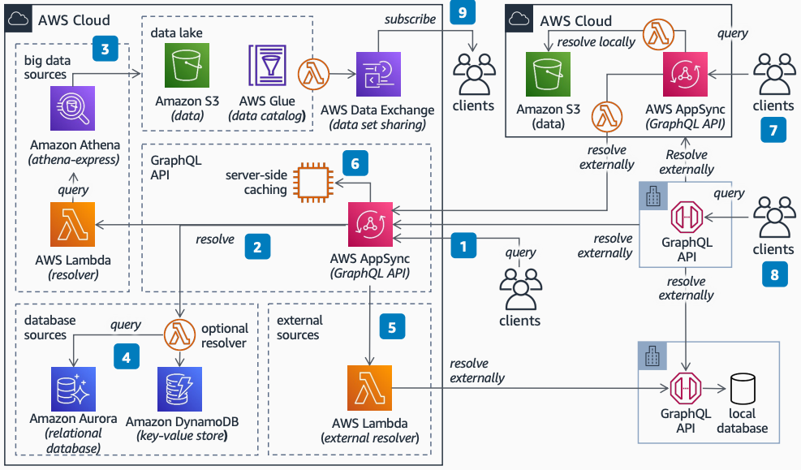

# Synchronous Data Mesh for GraphQL Queries

Publication date: **April 25, 2022 ([Diagram history](#diagram-history "#diagram-history"))**

This architecture shows how to use an API composition pattern to build a modern, distributed, and decentralized data architecture. It enables clients to query data where it lives, without first transporting it to a data lake or data warehouse. It also allows domain-specific teams to own and serve data as a product.

## Synchronous Data Mesh for GraphQL Queries

The following steps describe the architecture:

1. Expose your domain's schema through an HTTPS API with [Amazon AppSync](../../../appsync/latest/devguide/what-is-appsync.md "../../../appsync/latest/devguide/what-is-appsync.md"), allowing users to dynamically query a domain's data with GraphQL syntax.
2. Compose the returning query results with a combination of resolvers built with [AWS Lambda](../../../lambda/latest/dg/welcome.md "../../../lambda/latest/dg/welcome.md") functions.
3. For data partially available in a data lake, retrieve the data by running SQL queries supported by [Athena](../../../athena/latest/ug/what-is.md "../../../athena/latest/ug/what-is.md"). Run the Athena jobs asynchronously with the [athena-express](https://aws.amazon.com/blogs/apn/using-athena-express-to-simplify-sql-queries-on-amazon-athena/ "https://aws.amazon.com/blogs/apn/using-athena-express-to-simplify-sql-queries-on-amazon-athena/") library.
4. For data partially available in databases, retrieve the data either directly from Amazon AppSync, or by using Lambda functions as proxy resolvers to your databases.
5. For data partially available in external sources, use Lambda resolvers to fetch the data by invoking remote HTTP APIs.
6. To improve your API's performance, enable server-side caching on Amazon AppSync.
7. Other parties using AWS can replicate this architecture in their domains, also allowing clients to query their APIs using GraphQL, and composing the results with internal and external resolvers.
8. Parties that do not use AWS can also expose their domains with GraphQL APIs built with other technologies, providing a seamless experience to clients.
9. To retrieve large datasets, clients can subscribe to AWS Data Exchange instead.

## Further reading

For additional information, refer to the following resources:

- [AWS Architecture Icons](https://aws.amazon.com/architecture/icons "https://aws.amazon.com/architecture/icons")
- [AWS Architecture Center](https://aws.amazon.com/architecture "https://aws.amazon.com/architecture")
- [AWS Well-Architected](https://aws.amazon.com/architecture/well-architected "https://aws.amazon.com/architecture/well-architected")

## Diagram history

To be notified about updates to this reference architecture diagram, subscribe to the RSS feed.

| Change              | Description                                     | Date           |
| ------------------- | ----------------------------------------------- | -------------- |
| Initial publication | Reference architecture diagram first published. | April 25, 2022 |

###### Note

To subscribe to RSS updates, you must have an RSS plugin enabled for the browser you are using.
