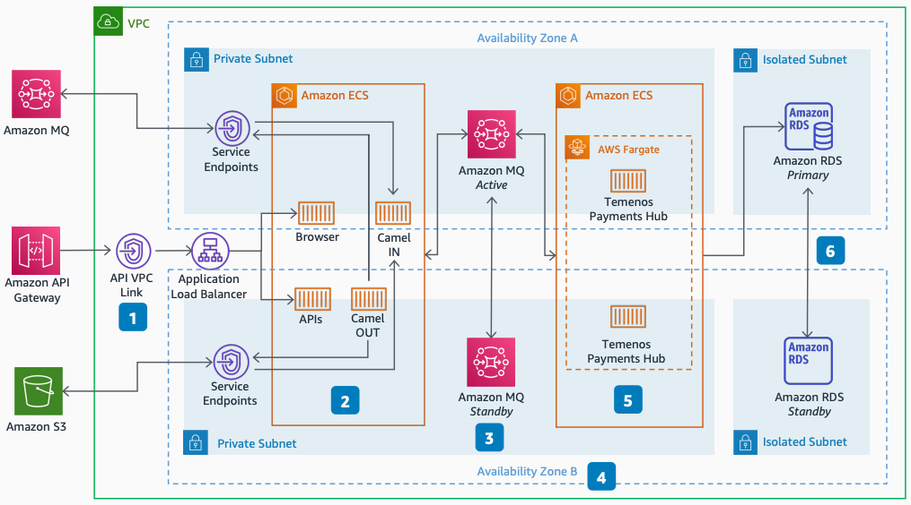

# Temenos Payments Hub: Availability Zones architecture

Publication date: **September 2, 2021 ([Diagram history](#tph-az-history "#tph-az-history"))**

With this architecture, you can deploy Temenos Payments Hub with high
availability across multiple Availability Zones. The solution uses [Amazon Elastic Container Service](../../../AmazonECS/latest/developerguide.md "../../../AmazonECS/latest/developerguide.md") containers on [AWS Fargate](../../../AmazonECS/latest/userguide/what-is-fargate.md "../../../AmazonECS/latest/userguide/what-is-fargate.md")
with automatic scaling, and [Amazon MQ](../../../amazon-mq/latest/developer-guide.md "../../../amazon-mq/latest/developer-guide.md") for messaging.

## Temenos Payments Hub Availability Zones diagram

The following steps describe the high availability components for this
architecture:

1. Connect [Amazon API Gateway](../../../apigateway/latest/developerguide.md "../../../apigateway/latest/developerguide.md") HTTP API directly to the
   Application Load Balancer through the VpcLink resource.
2. Run Amazon ECS containers on AWS Fargate. You can also run your containers on [Amazon Elastic Compute Cloud](../../../AWSEC2/latest/UserGuide.md "../../../AWSEC2/latest/UserGuide.md"), or a
   combination of both AWS Fargate and Amazon EC2.
3. Use Amazon MQ active/standby for high availability messaging. You can also use a network
   of brokers for fast reconnection.
4. Extend this architecture to three Availability Zones for additional
   resilience.
5. Use automatic scaling capabilities for all container services.
6. Enhance database availability by using [Amazon RDS](../../../AmazonRDS/latest/UserGuide.md "../../../AmazonRDS/latest/UserGuide.md") Multi-AZ deployment.

## Further reading

For additional information, see the following resources:

- [AWS Architecture Icons](https://aws.amazon.com/architecture/icons "https://aws.amazon.com/architecture/icons")
- [AWS Architecture Center](https://aws.amazon.com/architecture/ "https://aws.amazon.com/architecture/")
- [AWS
  Well-Architected](https://aws.amazon.com/architecture/well-architected "https://aws.amazon.com/architecture/well-architected")

## Diagram history

To receive updates about this reference architecture diagram, subscribe to the RSS
feed.

| Change                                                                                                                   | Description                                     | Date              |
| ------------------------------------------------------------------------------------------------------------------------ | ----------------------------------------------- | ----------------- |
| [Initial publication](temenos-payments-hub-service.md#tph-svc-history "temenos-payments-hub-service.md#tph-svc-history") | Reference architecture diagram first published. | September 2, 2021 |
| Initial publication                                                                                                      | Reference architecture diagram first published. | September 2, 2021 |

###### RSS subscription requirement

To subscribe to RSS updates, you must have an RSS plugin enabled for the browser you are
using.
