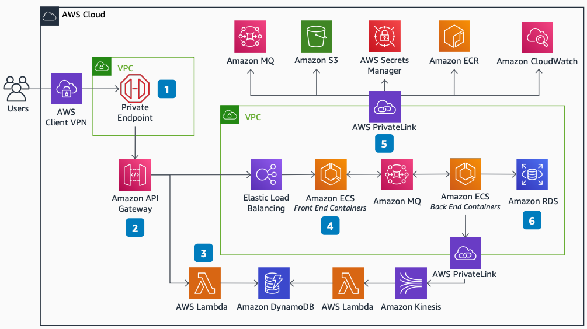

# Temenos Payments Hub: Service architecture

Publication date: **September 2, 2021 ([Diagram history](#tph-svc-history "#tph-svc-history"))**

With this architecture, you can deploy the Temenos Payments Hub on AWS.
This comprehensive platform for payment initiation and distribution uses [Amazon API Gateway](../../../apigateway/latest/developerguide.md "../../../apigateway/latest/developerguide.md") for API
management, [Amazon Elastic Container Service](../../../AmazonECS/latest/developerguide.md "../../../AmazonECS/latest/developerguide.md") for containerized processing, and
[AWS Lambda](../../../lambda/latest/dg.md "../../../lambda/latest/dg.md") for lightweight
microservices.

## Temenos Payments Hub service diagram

The following steps describe the service components and data flow for this
architecture:

1. Use Amazon API Gateway private endpoints for secure on-premises access through a VPN or
   [AWS Direct Connect](../../../directconnect/latest/UserGuide.md "../../../directconnect/latest/UserGuide.md").
2. Control and monitor access to the application and its APIs through Amazon API Gateway.
3. Deploy lightweight microservices in Lambda with an optimized data store in [Amazon DynamoDB](../../../amazondynamodb/latest/developerguide.md "../../../amazondynamodb/latest/developerguide.md").
4. Handle online transaction processing (OLTP) in scalable, containerized application
   processes running in Amazon ECS.
5. Access AWS services, including [Amazon Simple Storage Service](../../../AmazonS3/latest/userguide.md "../../../AmazonS3/latest/userguide.md") and [Amazon Elastic Container Registry](../../../AmazonECR/latest/userguide.md "../../../AmazonECR/latest/userguide.md"), from within the Amazon VPC through
   endpoints. This removes the need for internet access.
6. Choose from relational database options including [Amazon RDS for Oracle](../../../AmazonRDS/latest/UserGuide.md "../../../AmazonRDS/latest/UserGuide.md"), [Amazon Aurora](../../../AmazonRDS/latest/AuroraUserGuide.md "../../../AmazonRDS/latest/AuroraUserGuide.md"), and
   NuoDB.

## Further reading

For additional information, see the following resources:

- [AWS Architecture Icons](https://aws.amazon.com/architecture/icons "https://aws.amazon.com/architecture/icons")
- [AWS Architecture Center](https://aws.amazon.com/architecture/ "https://aws.amazon.com/architecture/")
- [AWS
  Well-Architected](https://aws.amazon.com/architecture/well-architected "https://aws.amazon.com/architecture/well-architected")

## Diagram history

To receive updates about this reference architecture diagram, subscribe to the RSS
feed.

| Change                                                                                                                           | Description                                     | Date              |
| -------------------------------------------------------------------------------------------------------------------------------- | ----------------------------------------------- | ----------------- |
| Initial publication                                                                                                              | Reference architecture diagram first published. | September 2, 2021 |
| [Initial publication](temenos-payments-hub-availability.md#tph-az-history "temenos-payments-hub-availability.md#tph-az-history") | Reference architecture diagram first published. | September 2, 2021 |

###### RSS subscription requirement

To subscribe to RSS updates, you must have an RSS plugin enabled for the browser you are
using.
