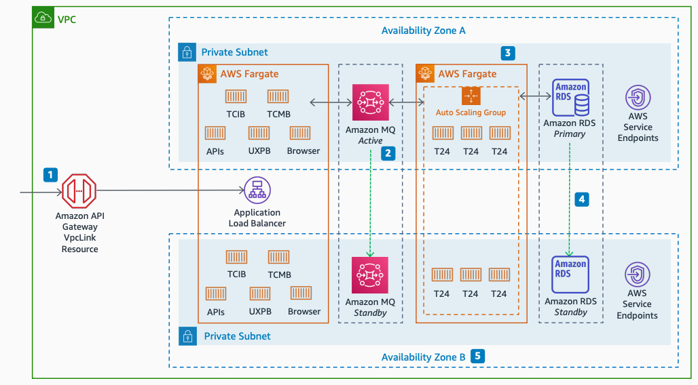

# Temenos T24 Transact: Availability Zones architecture

Publication date: **November 12, 2021 ([Diagram history](#t24-az-history "#t24-az-history"))**

With this architecture, you can deploy Temenos T24 with high availability
across multiple Availability Zones. The solution uses [Amazon API Gateway](../../../apigateway/latest/developerguide.md "../../../apigateway/latest/developerguide.md") HTTP API connected to an
Application Load Balancer, [AWS Fargate](../../../AmazonECS/latest/userguide/what-is-fargate.md "../../../AmazonECS/latest/userguide/what-is-fargate.md") with automatic
scaling, and [Amazon MQ](../../../amazon-mq/latest/developer-guide.md "../../../amazon-mq/latest/developer-guide.md") for messaging.

## Temenos T24 Availability Zones diagram

The following steps describe the high availability components for this
architecture:

1. Connect Amazon API Gateway HTTP API directly to the Application Load Balancer through the
   VpcLink resource.
2. Use Amazon MQ active-standby for high availability. You can also use a network of
   brokers for fast reconnection.
3. Use automatic scaling capabilities for all container services.
4. Enhance database availability by using [Amazon RDS](../../../AmazonRDS/latest/UserGuide.md "../../../AmazonRDS/latest/UserGuide.md") Multi-AZ.
5. Extend this architecture to three Availability Zones for additional
   resilience.

## Further reading

For additional information, see the following resources:

- [AWS Architecture Icons](https://aws.amazon.com/architecture/icons "https://aws.amazon.com/architecture/icons")
- [AWS Architecture Center](https://aws.amazon.com/architecture/ "https://aws.amazon.com/architecture/")
- [AWS
  Well-Architected](https://aws.amazon.com/architecture/well-architected "https://aws.amazon.com/architecture/well-architected")

## Diagram history

To receive updates about this reference architecture diagram, subscribe to the RSS
feed.

| Change                                                                                                               | Description                                     | Date              |
| -------------------------------------------------------------------------------------------------------------------- | ----------------------------------------------- | ----------------- |
| [Initial publication](temenos-t24-service.md#t24-svc-history "temenos-t24-service.md#t24-svc-history")               | Reference architecture diagram first published. | November 12, 2021 |
| [Initial publication](temenos-t24-vpc-networking.md#t24-vpc-history "temenos-t24-vpc-networking.md#t24-vpc-history") | Reference architecture diagram first published. | November 12, 2021 |
| Initial publication                                                                                                  | Reference architecture diagram first published. | November 12, 2021 |

###### RSS subscription requirement

To subscribe to RSS updates, you must have an RSS plugin enabled for the browser you are
using.
