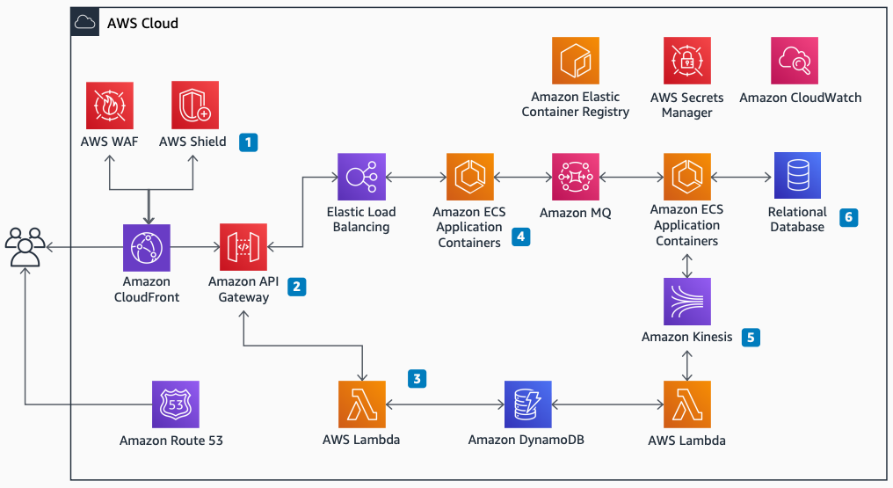

# Temenos T24 Transact: Service architecture

Publication date: **November 12, 2021 ([Diagram history](#t24-svc-history "#t24-svc-history"))**

With this architecture, you can deploy the Temenos T24 Transact core
banking solution on AWS. The solution uses [Amazon API Gateway](../../../apigateway/latest/developerguide.md "../../../apigateway/latest/developerguide.md") for access control, [Amazon Elastic Container Service](../../../AmazonECS/latest/developerguide.md "../../../AmazonECS/latest/developerguide.md") for
containerized online transaction processing (OLTP), and [AWS Lambda](../../../lambda/latest/dg.md "../../../lambda/latest/dg.md") with [Amazon DynamoDB](../../../amazondynamodb/latest/developerguide.md "../../../amazondynamodb/latest/developerguide.md") for read-only queries.

## Temenos T24 Transact service diagram

The following steps describe the service components and data flow for this
architecture:

1. Provide security at the perimeter by using AWS security services such as [AWS WAF](../../../waf/latest/developerguide.md "../../../waf/latest/developerguide.md") (web application
   firewall) and [AWS Shield](../../../waf/latest/developerguide/shield-chapter.md "../../../waf/latest/developerguide/shield-chapter.md").
2. Control and monitor access to T24 through Amazon API Gateway.
3. Handle read-only query activity by using Lambda processing and query-optimized
   DynamoDB storage.
4. Handle OLTP transactions in scalable, containerized application processes running in
   Amazon ECS.
5. Ingest events from selected topics of [Amazon Kinesis Data Streams](../../../streams/latest/dev.md "../../../streams/latest/dev.md") into DynamoDB tables by using
   Lambda.
6. Choose from relational database options including [Amazon Aurora](../../../AmazonRDS/latest/AuroraUserGuide.md "../../../AmazonRDS/latest/AuroraUserGuide.md"), [Amazon RDS for Oracle](../../../AmazonRDS/latest/UserGuide.md "../../../AmazonRDS/latest/UserGuide.md"), Amazon RDS for SQL Server, or
   NuoDB.

## Further reading

For additional information, see the following resources:

- [AWS Architecture Icons](https://aws.amazon.com/architecture/icons "https://aws.amazon.com/architecture/icons")
- [AWS Architecture Center](https://aws.amazon.com/architecture/ "https://aws.amazon.com/architecture/")
- [AWS
  Well-Architected](https://aws.amazon.com/architecture/well-architected "https://aws.amazon.com/architecture/well-architected")

## Diagram history

To receive updates about this reference architecture diagram, subscribe to the RSS
feed.

| Change                                                                                                                     | Description                                     | Date              |
| -------------------------------------------------------------------------------------------------------------------------- | ----------------------------------------------- | ----------------- |
| Initial publication                                                                                                        | Reference architecture diagram first published. | November 12, 2021 |
| [Initial publication](temenos-t24-vpc-networking.md#t24-vpc-history "temenos-t24-vpc-networking.md#t24-vpc-history")       | Reference architecture diagram first published. | November 12, 2021 |
| [Initial publication](temenos-t24-availability-zones.md#t24-az-history "temenos-t24-availability-zones.md#t24-az-history") | Reference architecture diagram first published. | November 12, 2021 |

###### RSS subscription requirement

To subscribe to RSS updates, you must have an RSS plugin enabled for the browser you are
using.
