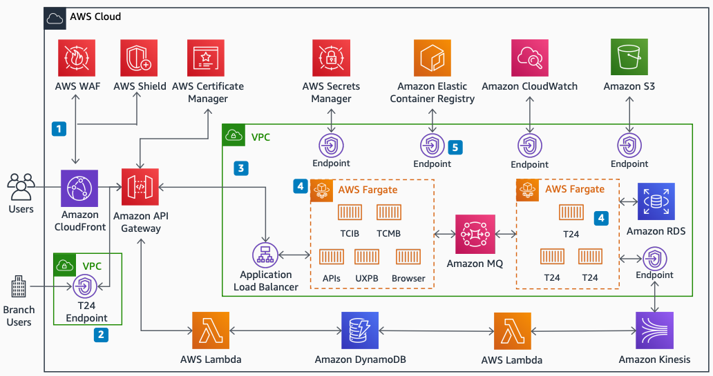

# Temenos T24 Transact: Amazon VPC and networking

Publication date: **November 12, 2021 ([Diagram history](#t24-vpc-history "#t24-vpc-history"))**

With this architecture, you can deploy Temenos T24 with Amazon VPC isolation and
secure network access. The solution uses [Amazon API Gateway](../../../apigateway/latest/developerguide.md "../../../apigateway/latest/developerguide.md") private endpoints for on-premises
connectivity and [AWS Fargate](../../../AmazonECS/latest/userguide/what-is-fargate.md "../../../AmazonECS/latest/userguide/what-is-fargate.md") for container
compute.

## Temenos T24 Amazon VPC and networking diagram

The following steps describe the networking and access components for this
architecture:

1. Use [Amazon CloudFront](../../../AmazonCloudFront/latest/DeveloperGuide.md "../../../AmazonCloudFront/latest/DeveloperGuide.md"), [AWS WAF](../../../waf/latest/developerguide.md "../../../waf/latest/developerguide.md"), and [AWS Shield](../../../waf/latest/developerguide/shield-chapter.md "../../../waf/latest/developerguide/shield-chapter.md") for security
   and performance for internet usage.
2. Use Amazon API Gateway private endpoints for secure on-premises access through a VPN or
   [AWS Direct Connect](../../../directconnect/latest/UserGuide.md "../../../directconnect/latest/UserGuide.md").
3. Restrict access to the Amazon VPC to only through the Amazon API Gateway VpcLink
   resource.
4. Run [Amazon Elastic Container Service](../../../AmazonECS/latest/developerguide.md "../../../AmazonECS/latest/developerguide.md") containers on AWS Fargate.
   You can also run your containers on [Amazon Elastic Compute Cloud](../../../AWSEC2/latest/UserGuide.md "../../../AWSEC2/latest/UserGuide.md"), or a combination of both
   AWS Fargate and Amazon EC2.
5. Access AWS services from within the Amazon VPC through endpoints. This removes the need
   for internet access.

## Further reading

For additional information, see the following resources:

- [AWS Architecture Icons](https://aws.amazon.com/architecture/icons "https://aws.amazon.com/architecture/icons")
- [AWS Architecture Center](https://aws.amazon.com/architecture/ "https://aws.amazon.com/architecture/")
- [AWS
  Well-Architected](https://aws.amazon.com/architecture/well-architected "https://aws.amazon.com/architecture/well-architected")

## Diagram history

To receive updates about this reference architecture diagram, subscribe to the RSS
feed.

| Change                                                                                                                     | Description                                     | Date              |
| -------------------------------------------------------------------------------------------------------------------------- | ----------------------------------------------- | ----------------- |
| [Initial publication](temenos-t24-service.md#t24-svc-history "temenos-t24-service.md#t24-svc-history")                     | Reference architecture diagram first published. | November 12, 2021 |
| Initial publication                                                                                                        | Reference architecture diagram first published. | November 12, 2021 |
| [Initial publication](temenos-t24-availability-zones.md#t24-az-history "temenos-t24-availability-zones.md#t24-az-history") | Reference architecture diagram first published. | November 12, 2021 |

###### RSS subscription requirement

To subscribe to RSS updates, you must have an RSS plugin enabled for the browser you are
using.
