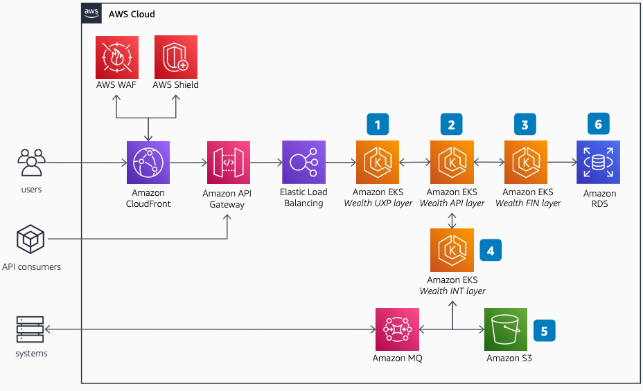

# Temenos WealthSuite Front Office on AWS: Overview

Publication date: **January 6, 2023 ([Diagram history](#tw-ov-history "#tw-ov-history"))**

With this architecture, you can deploy the Temenos WealthSuite Front Office
platform for wealth managers and private bankers. The solution uses [Amazon Elastic Kubernetes Service](../../../eks/latest/userguide.md "../../../eks/latest/userguide.md") for containerized application layers, [Amazon API Gateway](../../../apigateway/latest/developerguide.md "../../../apigateway/latest/developerguide.md") for API
management, and [Amazon RDS](../../../AmazonRDS/latest/UserGuide.md "../../../AmazonRDS/latest/UserGuide.md") for database services.

## Temenos WealthSuite overview diagram

The following steps describe the application layers and data flow for this
architecture:

1. Serve the User Experience Platform (UXP) layer through Amazon EKS. The UXP includes an
   integrated development environment (IDE)-based UI and user experience (UX) designer with
   support for major mobile platforms.
2. Use the API layer on Amazon EKS as the key entry point for external interfaces. This
   layer contains the application business logic.
3. Run Finance Services (FIN) as a scalable set of calculation engines on Amazon EKS.
   Initiate processing from the API layer.
4. Support data import, extract, routing, and transformation through the Integration
   Layer (INT) on Amazon EKS. Process data in batch or near real-time modes across transport
   mechanisms including SFTP, HTTPS, [Amazon MQ](../../../amazon-mq/latest/developer-guide.md "../../../amazon-mq/latest/developer-guide.md"), Apache Kafka,
   and Enterprise Service Bus (ESB).
5. Use multiple AWS services as sources or targets of integration data, including
   Amazon MQ and [Amazon Simple Storage Service](../../../AmazonS3/latest/userguide.md "../../../AmazonS3/latest/userguide.md").
6. Run the database on Amazon RDS for Oracle managed relational database
   services.

## Further reading

For additional information, see the following resources:

- [AWS Architecture Icons](https://aws.amazon.com/architecture/icons "https://aws.amazon.com/architecture/icons")
- [AWS Architecture Center](https://aws.amazon.com/architecture/ "https://aws.amazon.com/architecture/")
- [AWS
  Well-Architected](https://aws.amazon.com/architecture/well-architected "https://aws.amazon.com/architecture/well-architected")

## Diagram history

To receive updates about this reference architecture diagram, subscribe to the RSS
feed.

| Change                                                                                                                             | Description                                     | Date            |
| ---------------------------------------------------------------------------------------------------------------------------------- | ----------------------------------------------- | --------------- |
| Initial publication                                                                                                                | Reference architecture diagram first published. | January 6, 2023 |
| [Initial publication](temenos-wealthsuite-vpc-networking.md#tw-vpc-history "temenos-wealthsuite-vpc-networking.md#tw-vpc-history") | Reference architecture diagram first published. | January 6, 2023 |

###### RSS subscription requirement

To subscribe to RSS updates, you must have an RSS plugin enabled for the browser you are
using.
