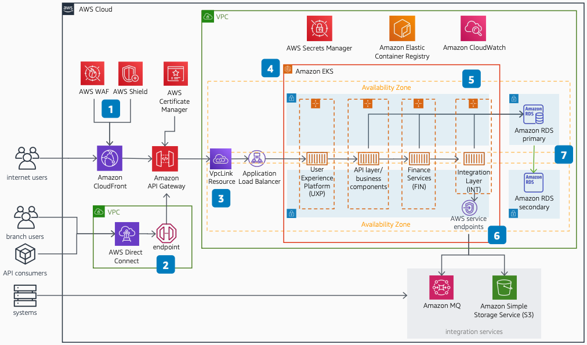

# Temenos WealthSuite Front Office on AWS: Amazon VPC and networking

Publication date: **January 6, 2023 ([Diagram history](#tw-vpc-history "#tw-vpc-history"))**

With this architecture, you can deploy Temenos WealthSuite with Amazon VPC
isolation and secure network access. The solution uses [Amazon API Gateway](../../../apigateway/latest/developerguide.md "../../../apigateway/latest/developerguide.md") private endpoints, [Amazon Elastic Kubernetes Service](../../../eks/latest/userguide.md "../../../eks/latest/userguide.md") containers on [AWS Fargate](../../../AmazonECS/latest/userguide/what-is-fargate.md "../../../AmazonECS/latest/userguide/what-is-fargate.md")
or [Amazon Elastic Compute Cloud](../../../AWSEC2/latest/UserGuide.md "../../../AWSEC2/latest/UserGuide.md"), and [AWS Direct Connect](../../../directconnect/latest/UserGuide.md "../../../directconnect/latest/UserGuide.md") for
on-premises connectivity.

## Temenos WealthSuite Amazon VPC and networking diagram

The following steps describe the networking and access components for this
architecture:

1. Use [Amazon CloudFront](../../../AmazonCloudFront/latest/DeveloperGuide.md "../../../AmazonCloudFront/latest/DeveloperGuide.md"), [AWS WAF](../../../waf/latest/developerguide.md "../../../waf/latest/developerguide.md"), and [AWS Shield](../../../waf/latest/developerguide/shield-chapter.md "../../../waf/latest/developerguide/shield-chapter.md") for security
   and performance for internet usage.
2. Use Amazon API Gateway private endpoints for secure on-premises access through a VPN or
   AWS Direct Connect.
3. Restrict access to the Amazon VPC to only through the Amazon API Gateway VpcLink
   resource.
4. Run Amazon EKS containers on AWS Fargate, Amazon EC2, or a combination of both.
5. Extend this architecture to three Availability Zones for additional
   resilience.
6. Access AWS services from within the Amazon VPC through endpoints. This removes the need
   for internet access.
7. Enhance database availability by using [Amazon RDS](../../../AmazonRDS/latest/UserGuide.md "../../../AmazonRDS/latest/UserGuide.md") Multi-AZ.

## Further reading

For additional information, see the following resources:

- [AWS Architecture Icons](https://aws.amazon.com/architecture/icons "https://aws.amazon.com/architecture/icons")
- [AWS Architecture Center](https://aws.amazon.com/architecture/ "https://aws.amazon.com/architecture/")
- [AWS
  Well-Architected](https://aws.amazon.com/architecture/well-architected "https://aws.amazon.com/architecture/well-architected")

## Diagram history

To receive updates about this reference architecture diagram, subscribe to the RSS
feed.

| Change                                                                                                               | Description                                     | Date            |
| -------------------------------------------------------------------------------------------------------------------- | ----------------------------------------------- | --------------- |
| [Initial publication](temenos-wealthsuite-overview.md#tw-ov-history "temenos-wealthsuite-overview.md#tw-ov-history") | Reference architecture diagram first published. | January 6, 2023 |
| Initial publication                                                                                                  | Reference architecture diagram first published. | January 6, 2023 |

###### RSS subscription requirement

To subscribe to RSS updates, you must have an RSS plugin enabled for the browser you are
using.
